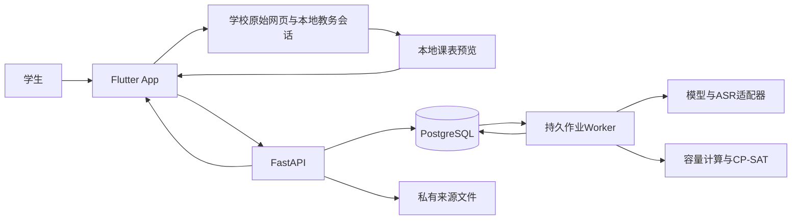
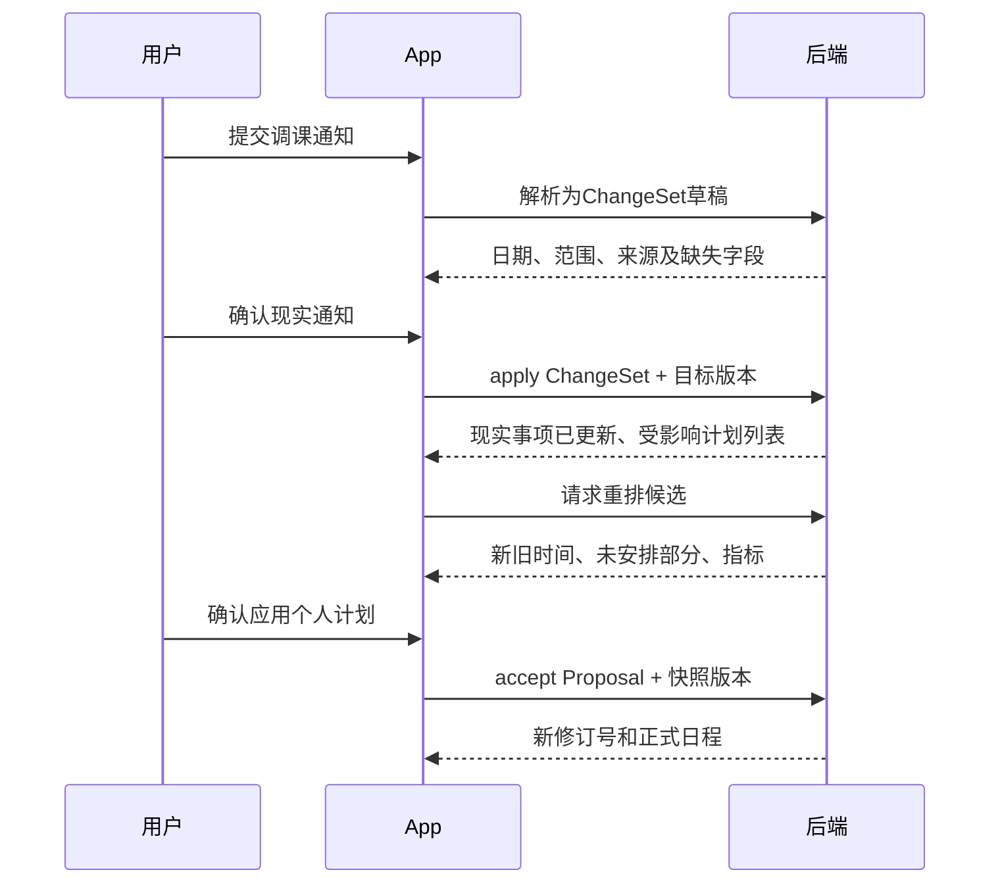

# 学期OS（Semester OS）
## 02｜技术设计 V1.1

> 日期：2026-09-19。依据：01产品需求V1.2、03交互设计V1.1、04测试说明V1.2、05需求确认与教务接入调研及用户最新确认。
> 本文是开发设计基线，不代表代码、性能或教务登录已经验证。交付为Android App，多用户注册，iOS后续适配；不编制按日排期。
> V1.1局部修订：补充事项级提醒、轻量录入的保存条件、受限自然语言修改、匿名演示环境和卡片余量展示合同；保留既有架构与规划算法。

## 1. 设计结论与技术选型

采用 **Flutter移动端 + Python/FastAPI模块化后端 + PostgreSQL + OR-Tools CP-SAT**。大模型负责解析与解释，确定性业务代码计算时间容量，约束求解器生成候选计划，用户确认后才写入正式日程。

### 1.1 移动端方案比较

| 方案 | 本项目的收益 | 主要代价 | 结论 |
| --- | --- | --- | --- |
| Flutter | Android先交付，后续复用大部分UI与业务逻辑；适合定制课表和卡片 | 教务WebView、通知仍需平台验证；引入Dart | 本版设计选用 |
| Kotlin + Jetpack Compose | Android系统能力接入直接 | 后续iOS界面与平台层需要另一套实现 | 作为原生能力疑难问题的参考，不维护第二套UI |
| React Native | TypeScript生态，适合已有React团队 | 当前没有React代码资产可复用，同样需要原生桥接 | 本版不选 |

这是根据项目边界作出的工程选择，不宣称某框架普遍优于其他框架。Flutter按官方建议区分View、ViewModel、Repository和Service，复杂用例才增加领域层。[架构依据](https://docs.flutter.dev/app-architecture/guide)

### 1.2 组件职责

| 层 | 选择 | 职责与边界 |
| --- | --- | --- |
| 移动UI | Flutter / Dart / Material 3 | 页面、可访问性、生命周期；视觉遵循03的校园活力风 |
| 状态与路由 | Riverpod、go_router | 按功能管理状态，统一登录与学期路由；不把业务计算放进Widget |
| HTTP | Dio | 鉴权、取消、错误映射；禁止重试产生重复写入 |
| 本地数据 | SQLite（Drift）+ 系统安全存储封装 | 日程缓存、离线记录草稿；令牌进入系统安全存储 |
| 教务页面 | 官方webview_flutter + 必要的平台扩展 | 原站认证、白名单课表读取、会话清理；不代理账号密码 |
| API | FastAPI + Pydantic | 输入校验、鉴权、业务事务、OpenAPI合同 |
| 持久化 | PostgreSQL + SQLAlchemy + Alembic | 多用户数据、版本、持久作业、迁移 |
| 文件 | 私有文件存储接口 | 开发期本地持久卷；部署可替换为私有对象存储，读取必须鉴权 |
| 规划 | OR-Tools CP-SAT | 可行性、初次规划、最小扰动重排；独立于模型厂商 |
| AI | 文本/视觉解析、ASR适配接口 | 供应商配置在服务端，输出统一结构；选择门槛见第7节 |
| 长任务 | PostgreSQL作业表 + 独立Python worker | 解析、求解可恢复；V1不额外引入Redis和分布式任务平台 |
| 交付 | Android签名APK；后端Docker Compose | API、worker、数据库和私有文件卷分开，正式入口HTTPS |

上表为选型，非声称依赖已经安装。建项时选相互兼容的稳定版本并提交`pubspec.lock`及Python锁文件，之后升级须重跑相关检查。Android设计下限为API 24，实际依赖下限与目标SDK以构建时核验为准；当前官方WebView插件声明支持Android SDK 24+及iOS。[插件依据](https://pub.dev/packages/webview_flutter)

## 2. 系统结构与数据流



教务密码与Cookie只留在学校页面会话，图中不存在学校认证令牌到API或模型的链路。App上传的是用户确认后的最小课表数据。学校接入使用事宜已由用户协调，不再作为待确认项。

### 2.1 模块边界

- `accounts`：注册、会话与恢复码；提供当前用户身份。
- `semesters`：校历、周次、节次与用户时间偏好。
- `sources`：原始文字/音频/图片、解析作业、候选字段及证据位置。
- `academics`：课程、重复规则、具体课次、考试、导入批次与变化。
- `tasks`：作业、复习、个人任务、工作量和用户确认的进度。
- `planning`：输入快照、容量、求解、方案差异、接受和撤销。
- `readmodels`：今日、周课表、学期时间轴、课程详情等查询投影。
- `reminders`：提醒规则及移动端待安排清单。

先采用同一后端内的模块化结构，各模块通过应用服务协作，不拆微服务。客户端只接收服务端计算的正式风险结果；离线时显示带时间戳的缓存，不另算一套风险算法。

### 2.2 建议目录

```text
apps/mobile/lib/
  app/                 路由、主题、会话和依赖组装
  core/                网络、错误、时间显示、平台接口
  features/            accounts、capture、today、timetable、planning、semester
services/api/app/
  api/                 HTTP合同及错误映射
  domains/             上述业务模块
  infrastructure/      数据库、文件、AI适配、作业执行
  worker/              持久作业消费者
services/api/tests/    领域测试、接口与多用户隔离测试
fixtures/              明确标为合成的数据与预期结果
benchmarks/            固定输入、算法配置、原始实验输出
deploy/                Compose、迁移与运行说明
docs/                  01—05及后续验证记录
```

## 3. 不允许破坏的业务规则

1. 学校事项只能依据用户确认的新证据更新；规划器没有修改课程或考试的写接口。
2. 用户锁定的计划时间块在明确解锁前不移动；无法满足时返回不可行或冲突。
3. 正式通知、用户确认和事项完成是不同维度；用户确认暂定通知不会使它变正式。
4. 工作量和计划时间块是两种数据；安排过、时间已过去均不等于完成。
5. 所有事项与来源按用户隔离；不能靠客户端传入的`user_id`决定归属。
6. 解析、导入与规划均有草稿/候选阶段；客户端收到候选结果不代表已应用。
7. 正式写入带版本检查；旧方案不能覆盖用户刚修改的课程或任务。
8. 现实变化可以使既有日程冲突，必须如实显示；零冲突指标针对通过验证的新计划。
9. 缺少日期或耗时则保留缺失，不用默认值冒充事实。
10. 构造演示、算法测试、真实试用分别标记来源，不能互相替代验收证据。

## 4. 时间与状态模型

### 4.1 时间表达

- 精确事件用UTC时间戳存储，并保留IANA时区；V1学校默认`Asia/Shanghai`。时间区间统一为左闭右开`[start, end)`，相邻安排不算冲突。
- 校历另存本地`date`，周次由用户确认的第一周周一计算。假期和补课是日期例外，不能简单跳过某周后重编号。
- 重复课程规则使用星期、明确周次集合与节次；展开为整个学期的具体课次实例。只在校历确认后将节次映射成时间。
- 部分时间使用`precision = exact | date | week | range | unknown`；周/日期字段单独保存，精确时间允许为空，不用午夜伪装已知开始时间。
- “周五交”保留日期精度。规划前让用户确认日期截止口径，例如“按周五当天结束前规划”；派生边界为周六00:00，标记`boundary_basis=user_confirmed_policy`，不改变原通知精度。
- 相对日期保存`reference_at`与解释依据。原消息日期已知时优先用原消息日期；转贴旧通知、年份或“下周”存在歧义时提示确认，不直接采用解析时刻。
- 时长以整数分钟记录；秒级输入向上取整并提示。展示可转换为小时，但计算不得先将3.1小时粗略取整为3小时。

### 4.2 正交状态

| 字段 | 值 | 用途 |
| --- | --- | --- |
| `certainty` | `formal / tentative / unknown` | 来源内容的确定性 |
| `review_state` | `pending / confirmed / rejected` | 用户是否核对候选事项 |
| `lifecycle` | `active / cancelled / completed / archived` | 依事项类型限制合法值；课程经过时间不自动标为已完成任务 |
| `control` | `authoritative / negotiable / plannable` | AI能否安排时间 |
| `field_evidence` | 字段到原文片段/图片区域/音频时间段的映射 | 追溯、标记推断及缺失 |
| `version` | 正整数 | 乐观并发控制 |

已确认参与的会议属于不可自动移动的占用；是否可协商不等于规划器可以移动。暂定且有精确时段的事项默认以“暂定预留”占用个人规划容量，明确显示为用户预留而非正式事实；用户可关闭该预留。仅知道考试周时不封锁整周，也不假定全天空闲无风险。

## 5. 数据模型与持久化约束

所有用户业务表含`user_id`、创建/修改时间；有关联的用户业务外键用`(user_id, id)`约束，防止跨账号关联。身份表与全局学校配置除外。

| 实体 | 核心字段 | 关系与用途 |
| --- | --- | --- |
| User / Session | 登录名、密码哈希；刷新令牌哈希、过期和撤销时间 | 注册与设备会话分离 |
| Semester | 名称、时区、第一周周一、总周数、节次表、`schedule_revision` | 每用户可有多个学期，当前学期是用户选择 |
| CalendarException | 日期、停课/替代教学日、作用范围、来源 | 校历例外，不默认为个人整日禁排 |
| Course | 名称、学校课程标识、教师、颜色键 | 课程事务聚合，颜色由稳定键决定 |
| CourseSeries | 课程ID、原始星期、周次、节次、来源批次 | 重复规则 |
| EventOccurrence | 类型、课程/系列ID、`occurrence_key`、具体/部分时间、地点、状态 | 正常课次、考试、活动等现实事项 |
| Task | 课程/考试ID、标题、可空的预计剩余分钟、截止、最早开始、可拆分、最小块长度、状态 | 工作需求；耗时未知不填0；考试复习是关联Task |
| ProgressEntry | 任务ID、用户确认的进度、可选实际用时、说明 | 完成工作量与实际耗时分别保存 |
| PlanBlock | 任务ID、开始/结束、计划分钟、锁定标记、状态、版本 | 每个任务可对应多个时间块 |
| SourceRecord / SourceFile | 来源类型、原文/文件引用、消息日期、内容哈希 | 不包含学校账号密码和Cookie |
| ParseCandidate | 来源ID、候选字段、证据、缺失字段、审核状态、版本 | 一份通知可产生多个事项或变更 |
| OperationProposal | 指令来源ID、意图、目标ID、字段白名单、原值/新值、目标版本、依赖版本、状态 | 个人任务/提醒修改预览；不是任意数据库补丁 |
| ImportBatch / ImportItem | 适配器版本、学期、读取时间、规范化数据、差异、审核状态 | 可追溯、可重试、不重复导入 |
| ChangeSet / ChangeItem | 来源、目标版本、作用范围、前后字段、确认状态 | 用户确认现实变化的事务单位 |
| PlanProposal | 快照版本、输入哈希、范围、工作量目标、求解状态、块差异、指标、版本 | 候选方案，可过期或被应用 |
| PlanningJob | 类型、状态、租约、重试次数、输入、结果引用 | 持久长任务 |
| Revision / AuditEntry | 对象类型与ID、前后快照、操作者、原因、事务ID | 历史和审计；V1不实现完整事件溯源框架 |
| ReminderRule | 事项/任务ID、相对/绝对模式、锚点、提前分钟或指定时刻、用途、启用状态、版本 | 一事项多条规则，提醒不是复习计划 |
| IdempotencyRecord | 用户、接口、幂等键、请求哈希、响应引用、有效期 | 网络重试不能重复应用 |

### 5.1 关键唯一性与一致性

- 登录名规范化后唯一；客户端不自行判定账号可用，提交由数据库裁决。
- 一个重复课次使用稳定`occurrence_key`（系列ID + 原计划日期 + 原节次标识）；单次调课保留该键，不使用移动后的日期生成新身份。
- 有学校稳定课程/教学班ID时优先使用；无ID时组合字段只作为匹配候选。重名课、改教师或改地点有歧义时人工核对，不自动合并。
- 来源哈希只在同一用户内查重；同一截图多次解析不自动重复建事件，也不阻止用户明确建立不同事项。
- 正式PlanBlock要求`end > start`、分钟数匹配、任务未取消；已完成的历史块不参加未来重排。
- 对正式计划写入同时执行应用层校验和数据库事务保护。现实固定事项之间允许存有冲突，并单独返回冲突集合。

### 5.2 版本与事务

所有改变日程、剩余工作量或可用时间的写入，先锁定对应Semester行，检查调用者的对象版本，再在一个事务内更新对象、历史和`schedule_revision`。方案保存记录输入时的学期修订号；应用时不一致返回`409 SNAPSHOT_STALE`。

锁只用于短事务，不能持锁等待模型或求解器。创建候选方案时先读取一致快照，计算在事务外完成；应用时锁学期、复核最新硬约束再提交。这是本项目的事务设计，依赖数据库行锁机制。[PostgreSQL依据](https://www.postgresql.org/docs/current/explicit-locking.html)

## 6. 教务导入与变化传播

### 6.1 本地学校适配器

接口职责固定为`canRead(pageContext)`、`readTimetable(term)`、`normalize(raw)`；规范化结果包含课程、原周次/节次、地点、学校标识（若有）、原字段证据与缺失项。

流程：学校原页登录 → 进入本人课表 → 本地读取 → 本地预览 → 提交ImportBatch → 服务端校验并给出差异 → 用户确认应用。

- 只允许当前已验证的学校域名和课表页面触发读取；认证跳转域名由实测配置，不能允许任意网页调用原生桥。
- 同源请求复用WebView内会话，不把Cookie复制到API；学校验证码由用户正常完成。
- 读取结果只跨桥传递课表字段白名单，不能上传全站HTML、密码表单或认证响应。
- 教务状态不由“页面HTTP 200”判断；必须区分未登录、非课表页、空课表、读取错误和解析成功。
- 当前接口线索见05，只作为适配起点。网页内部参数与学期编码以登录后的实际表单为准。
- 退出账号要分别清理Cookie、缓存、本地存储和页面实例；官方插件的清缓存不等于清除本地存储，不能只调用一次`clearCache`就宣称退出完成。[WebView依据](https://pub.dev/packages/webview_flutter)

### 6.2 再次导入与冲突

差异至少分为新增、变更、来源缺席、未变化、匹配不明确。读取范围不完整或空响应不代表全部停课；来源缺席项必须由用户确认，不自动删除。已有独立调课通知或用户修正不能被较旧教务结果覆盖，展示两份来源供核对。

学期配置改变时先生成课次重建预览；保持既有课次标识及历史，不重置整个学期。课程停课只取消对应实例，保留课程与关联作业。

### 6.3 两阶段确认



即使用户退出重排页，已确认的现实变化也保留。影响分析失败时显示“通知已保存，影响分析待重试”，不能回滚通知或假装计划已修复。

## 7. AI解析与解释合同

### 7.1 供应商接口

定义`parseText`、`parseImage`、`transcribeAudio`、`explainFacts`四个接口；允许同一供应商承接多个接口。端点、模型名、密钥在服务端配置，客户端无密钥。本次未获指定供应商或测得效果，因此不写虚构模型名、成本或准确率。

开发顺序先用标为合成的固定响应完成合同联调，再接真实服务。接入模型时以一组独立留出样本比较字段正确率、遗漏/幻觉、延迟及调用成本，选一个文本/视觉服务和一个ASR服务；真实服务验证是“AI功能完成”的必需条件。选型与密钥可后置到接入阶段，不阻塞业务与UI开发。

### 7.2 输入与结构化输出

模型输入只含本次来源、明确的时间上下文、该用户相关课程候选和字段定义。原始通知是不可信数据，通知中要求执行指令、修改系统规则或访问额外账户的文本均不构成操作授权。

输出至少含：

```json
{
  "schema_version": "2",
  "intent": "create_item",
  "candidates": [{
    "kind": "task",
    "title": "Java实验报告",
    "course_candidates": [],
    "time": {"precision": "date", "date": "2026-09-25", "timezone": "Asia/Shanghai"},
    "remaining_minutes": 180,
    "certainty": "formal",
    "missing_fields": ["deadline_boundary"],
    "inferred_fields": [],
    "evidence": {"title": {"quote": "Java实验报告"}, "remaining_minutes": {"quote": "预计3小时"}}
  }]
}
```

样例中的`formal`表示通知用语无暂定表达，不能证明来源真实性；审核仍为pending。课程关联只允许返回服务端给出的候选ID，未匹配则留空。候选事项与变更使用不同schema，变更必须含目标候选、原时间、新时间和作用范围。

区分三种门槛：**记录**要求事项标题、类型及相应部分信息合法，允许任务耗时未知；**规划**还要求明确剩余工作量、可执行时段和本轮目标/截止边界；**相对提醒**要求对应时间锚点已确认。录入页可折叠非必要字段，但服务端不放宽规划和提醒的校验。耗时未知返回`remaining_minutes=null`，可保存任务，精确余量与自动排程状态为`needs_estimate`，不默认填0或模型估计值。

处理链：媒体检查 → ASR/视觉理解 → schema校验 → 日期/字段规则校验 → 课程候选匹配 → 原文对照预览。模型格式错误最多自动修复一次；仍失败保留来源并提供手工编辑。服务端禁止对缺失字段以无标记默认值补齐。

V1输入上限设为文本10000字符、单张图片10MB、单段录音120秒且20MB；均为产品初始边界，上传前显示限制。通过文件头校验格式，图片去除EXIF定位信息；无批量文档资料库。

### 7.3 解释必须可回溯

解释模块输入确定性`facts`，例如容量、工作量、冲突对象、移动前后时间和来源ID。关键数字由模板展示，模型不能改写。无模型时保留相同的事实卡与模板解释；推测原因和心理评价不属于输出字段。

每次真实调用保存供应商/模型标识、prompt版本、schema版本、耗时、错误及可取得的用量。日志不记录密码或完整私密原文；业务来源由私有存储单独保留。取消解析后迟到的结果不能自动转为正式事项。

### 7.4 受限自然语言修改【P0】

快速记录共用意图入口，允许输出`create_item`、`update_task`、`update_reminder`、`request_plan`、`report_change`、`clarify`或`unsupported`。修改指令、转贴通知和第三方来源保留不同来源标记；模型读到原通知内的祈使句不等于获得执行授权。

| 意图 | V1允许的作用 | 后续确认 |
| --- | --- | --- |
| `update_task` | 个人任务标题、预计剩余分钟、拆分设置 | OperationProposal前后对照；工作量变更影响计划块时复用进度预览规则 |
| `update_reminder` | 指定事项的一条提醒的增改停用 | 前后时刻、模式与用途预览，不改变事项时间 |
| `request_plan` | 给已选任务增加本轮安排目标，或重排用户选定的未完成部分 | 先确认任务范围、剩余工作量、时段/时长，再进入规划候选 |
| `report_change` | 记录调课、考试变更等现实通知 | 复用ChangeSet，要求来源、目标与范围，不直接改学校事项 |
| `clarify / unsupported` | 目标/语义不明确或超出支持范围 | 返回可选择的问题或手工入口，无写操作 |

首版不通过自然语言执行批量删除、自动完成任务、自动解锁、任意修改学校安排或静默移动截止时间。学校规定的作业截止修正需走明确的事实核对与来源记录，不作为个人排程偏好。

处理流程：

1. 解析意图与字段，不生成任意SQL、接口名或JSON路径补丁。
2. 在当前用户、当前学期内查找目标；当前详情页ID可作为候选上下文，但仍校验归属。多个“Java报告”先列出课程和截止供选择，不能凭名称随机选一个。同一事项有多条提醒时也需明确选择哪条；未明确“全部提醒”的指令不能默认覆盖全部，首版修改按单条预览。
3. 规范化时间与操作。用户说“周四晚上”时，仅在已有用户确认的精确时间约定下建议具体时刻，并展示依据；否则要求选择，不能无标记补为20:00。新增周日下午计划缺少时长时也先补充。
4. 服务端构造白名单OperationProposal，记录原值、拟改值、用户核对的解释、目标及依赖版本。提醒修改还需保存锚点事项版本，防止预览后考试已改期。
5. 用户确认后重新鉴权和校验版本，事务内应用并保存修改指令作为来源。只修改提醒不移动课程或个人时间块，不触发自动重排。
6. `request_plan`的确认仅提交PlanningJob；求解结果仍通过PlanProposal再次确认应用。不能把“确认生成”当作接受未知计划。

“把今晚没做完的任务重新安排一下”只生成待选任务与工作量核对面板；未点击完成的块不自动认定为未完成。没有额外剩余工作量时，“再加一段”需先确认是移动现有工作还是增加任务目标，不能重复排满。

“把概率论改到周五”先问清修改个人提醒、复习计划还是记录调课通知；“把概率论考试提醒改到周四20:00”若目标和日期唯一，则直接生成提醒预览，无须再泛化追问。

OperationProposal状态为`needs_clarification / ready / applied / rejected / stale`。预览编辑后重新校验；应用使用幂等键，目标版本过期返回409，禁止覆盖新修改。提醒类回退通过新的修改预览完成，不借用个人计划的undo接口。

## 8. 时间容量与风险分析

### 8.1 单任务口径

在任务i的已确认最早开始与截止之间：`U_i`为用户允许规划的时段，`F`为固定课程、考试、已确认活动、明确暂定预留和禁排的并集，`P_other`为其他任务有效已安排的占用并集。

```text
A_i = minutes(U_i \ (F ∪ P_other))
S_i = A_i - R_i
```

`R_i`为用户确认的剩余工作量，自己的有效未来计划时段保留在`A_i`中。与新课程冲突的旧时间块不算有效可用时间；过期未完成的时间块不抵扣剩余工作量。已完成进度只按明确记录更新，禁止同时从R和容量重复扣减。

### 8.2 多任务容量检查

对分析区间内的不同截止点d，选取本轮有明确截止且需在d前完成的任务集合`T_d`，包括未排程任务。总需求`D_d = Σ R_i`；容量从当前时刻到d的用户可用时段扣除固定占用，以及不属于`T_d`但本轮保持的其他计划占用。

属于`T_d`的已安排时段不再从容量扣除，因其工作量已经纳入D。缺口下界`G_d = max(0, D_d - C_d)`；若已知最早开始存在差异，再检查由这些最早开始/截止组成的子窗口，需求取必须完全落在该窗口内的任务。

容量缺口大于0可证明该窗口工作量无法全部完成；缺口为0只说明容量检查未发现超载，不证明可行。不可拆分、锁定、短空档和部分时间缺失交给求解/缺失提示处理。远期分析按明确数据扫描到学期末，不把超出当前周视图的任务当作不存在。

### 8.3 风险输出

返回`level`、`reason_codes`、容量明细、缺口下界、数据完整性、计算修订号和`computed_at`。

卡片使用同一结果中的`task_slack_minutes`（单任务计划余量）、`window_gap_minutes`（窗口缺口）和原因码，不在客户端重算等级。用于解释的`capacity_after_fixed_minutes`已扣固定占用、尚未扣其他任务；`other_plan_minutes`只扣一次，再减`remaining_minutes`得到单任务余量。自己的有效计划不计入`other_plan_minutes`。

初始规则版本`risk-v1`：

- 信息不足：关键截止或工作量未确认，不给精确低/中/高结论。
- 高风险：已逾期且剩余工作量>0、窗口缺口>0、存在未解决硬冲突，或完整求解证明不可行。
- 中风险：没有以上高风险条件，但单任务余量低于`max(30分钟, 0.2 × R_i)`；或存在未知具体时间的近期暂定事项。后者明确标为“不确定安排”。
- 低风险：数据完整、无已知冲突/缺口且余量达到阈值；文案为“当前记录下余量充足”，不保证现实一定完成。
- 求解超时或范围限制：显示分析未完成，不用超时推断不可行，也不降为低风险。

阈值是待测试校准的工程初值，不是经验证的学业风险模型。计划接受与进度更新后重算，所有页面使用同一修订号的数据。

显示优先级为未解决冲突/窗口缺口、数据缺失或计算过期、余量等级。单任务余量为正也不能覆盖整体高风险；可同时返回“计划余量3小时”和“时间冲突”。在数据完整且无其他风险时，剩余3小时、余量1.5小时高于`risk-v1`的36分钟阈值，不能仅为突出视觉将其标成偏低。耗时未知或旧修订号不得显示假定的精确余量。

## 9. 规划与最小扰动重排

### 9.1 规划范围与工作量目标

- 默认生成未来7天，可选14或28天；考试复习可选“安排到考试前”，28天以内支持完整窗口。
- 窗口内截止的任务默认纳入全部剩余工作量；无截止或截止在窗口外的任务由用户确认本轮目标分钟，可不纳入。本轮目标指窗口内要覆盖的总工作量（包含窗口内现有有效计划），不是在现有计划之上重复新增的工作量。未纳入工作量单列为“后续仍需安排”，不报告整个任务已排完。
- 超过28天的考试先安排用户确认的本阶段目标，保留远期余量分析和剩余工作量。不能把一周方案称为完整学期计划。
- 未来已锁定或窗口外的时间块保持；计算还能分配给本轮的剩余工作量时，扣除窗口外仍有效且在截止前的已有覆盖。窗口内未锁定旧块属于本轮重新安排的变量，锁定块属于本轮已固定覆盖，两者均只计一次。确认的本轮目标不得超过剩余工作量扣除窗口外有效覆盖后的值；既有计划已超出新工作量时先让用户处理多余时间块，不直接截断锁定块。方案同时报告“已有覆盖、本轮新增/调整、仍未安排”。
- V1最多每次100个任务、300个规划时间块；超出返回`INPUT_LIMIT`并让用户缩小范围，不静默截断。

### 9.2 求解模型

整数分钟为时间单位，保持真实课程和任务边界；用户拖动以5分钟吸附只是交互，不把真实固定时间四舍五入。

任务不允许拆分时建立一个连续区间；允许拆分时按照确认的建议块长预分块，默认45分钟、最小15分钟，尾段不足15分钟则并入前块。总工作量不足15分钟保留实际长度。建议块长不是课程节次，不擅自将3小时任务扩为4小时。

每个待排时间块有开始变量、固定时长与结束变量。合法开始域来自可用时段，约束结束不晚于截止、开始不早于可执行时间；所有不可并行区间使用互斥约束。用户锁定块固定开始与时长。区间与互斥建模采用CP-SAT能力，业务约束由本项目定义。[调度建模依据](https://developers.google.com/optimization/scheduling/job_shop)

在现有块长下无解，不等于任务允许任意拆分后仍无解。返回`CHUNKING_LIMITED`或当前分块下不可行原因，并提供“调整拆分方式”入口；重新拆分形成新候选，须用户确认。不得将这种结果写成实际日程数学上绝对无解。

### 9.3 初次规划与重排目标

初次规划先满足全部本轮目标，再优先安排高风险任务、提前留余量，减少偏离学习偏好和连续过长学习。连续90分钟作为初始软偏好，不能作为未告知用户的新硬约束。

重排保留现有时间块ID与时长，默认只改变开始时间；锁定及已完成块不改变。优化顺序：

1. 满足固定、锁定、截止、可用时段和全部目标工作量。
2. 最小化被移动任务数（任一现有块改变则该任务计1次）。
3. 最小化被移动时间块开始时间的绝对偏移总和，单位分钟。
4. 优化提前完成、连续学习和偏好时段。

采用分阶段求解：只有上一层证实最优才固定该最优值后优化下一层。总求解预算初值10秒；若只找到可行解，返回可行但未证实最优，不在材料中声称全局最小。记录各层界、目标值和耗时。[求解状态依据](https://developers.google.com/optimization/cp/cp_solver)

完整模型包含本轮所有可移动计划；可先用受影响任务的局部方案提供提示解，但不得把“局部最优”宣传为所有任务上的最小。多方案不是P0硬要求，首版优先提供一个有效可解释方案，用户可重新生成或调整偏好。

### 9.4 不可行与部分方案

业务状态包括`FEASIBLE_COMPLETE`、`FEASIBLE_PARTIAL`、`INFEASIBLE`、`TIMEOUT`、`INPUT_INVALID`、`INPUT_LIMIT`和`CHUNKING_LIMITED`；另存原始求解状态，二者不混用。

完整目标无法满足时保留原计划，展示冲突与未安排需求。用户明确选择“查看可安排部分”后，才运行允许部分完成的诊断求解；保持全部硬约束，优先高风险任务，并明确每项未安排分钟。部分方案接受时按钮与回执必须带“仍有X分钟未安排”，不计完整成功。

超时但已有通过独立校验的完整可行解可返回`FEASIBLE_COMPLETE`并注明未证明最优；无可行解且未证明无解返回TIMEOUT。失败原因集合不宣称为最小不可满足核，除非实现并验证了相应提取。

### 9.5 方案接受与撤销

接受接口以幂等键提交`proposal_id`、方案版本、预期学期修订号、部分方案确认标记。服务端重新检查锁定、时间、剩余工作量和方案状态，原子写入PlanBlock及Revision；重复请求返回同一结果。

单项手动修改会产生新的候选版本并重新校验，不能在已通过的候选上直接改时间后跳过检查。生成后发生新调课、进度更新或锁定，旧方案必须重新计算。

V1支持撤销最近一次已应用的个人方案。撤销为补偿事务：仅恢复该方案改变的个人时间块，检查这些块版本未被再次修改，且在最新现实事项下仍合法；不撤销课程通知。若无法恢复，显示原因并提供重新规划，绝不静默覆盖后来修改。

## 10. API与错误合同

前缀`/api/v1`。时间用ISO 8601，分钟为整数。列表使用游标分页。身份从服务端会话获取；接口路径里的实体ID还必须校验归属。

| 接口 | 作用 | 写入边界 |
| --- | --- | --- |
| `POST /auth/register`、`/auth/login`、`/auth/refresh`、`/auth/logout` | 账户会话 | 学期OS身份，不调用教务认证 |
| `POST /auth/recover` | 使用一次性恢复码重置密码 | 撤销旧会话，替换恢复码 |
| `GET/PATCH /me` | 当前用户、偏好 | 修改可用时间时增加相关学期修订号 |
| `GET/POST /semesters`、`PATCH /semesters/{id}` | 学期与校历 | 校历变更需返回重建预览后确认 |
| `POST /imports`、`GET /imports/{id}`、`POST /imports/{id}/apply` | 课表规范化与差异确认 | 创建批次不等于应用 |
| `POST /sources`、`POST /sources/{id}/parse` | 保存来源、提交解析 | 返回来源ID或job_id，不创建正式事件 |
| `GET/PATCH /candidates/{id}`、`POST /candidates/{id}/confirm` | 查看、修正、确认解析候选 | 普通事项确认；变更候选转ChangeSet预览 |
| `GET/PATCH /operations/{id}`、`POST /operations/{id}/apply`、`/operations/{id}/reject` | 核对/修正/应用/拒绝自然语言修改 | 白名单字段、明确目标、版本检查；规划请求只进入规划流程 |
| `GET/POST /tasks`、`PATCH /tasks/{id}` | 手工任务管理 | 与AI结果共用同一校验 |
| `POST /tasks/{id}/progress` | 用户确认进度/完成 | 返回计划块处理预览，需要释放的未来块明确确认 |
| `GET/POST /events`、`PATCH /events/{id}` | 手工现实事项 | 修改需来源/原因，批量课程改动转ChangeSet |
| `POST /changes`、`GET /changes/{id}`、`POST /changes/{id}/apply` | 现实变化确认 | 必须携带目标版本与生效范围 |
| `GET /semesters/{id}/risks` | 风险和容量明细 | 带修订号与计算状态 |
| `POST /planning/jobs`、`GET /jobs/{id}`、`POST /jobs/{id}/cancel` | 规划/解析作业状态与取消 | 取消不撤销已确认现实事件 |
| `GET /proposals/{id}`、`PATCH /proposals/{id}` | 查看/修改候选 | 修改使校验结果失效，校验后返回新版本 |
| `POST /proposals/{id}/accept`、`/proposals/{id}/undo` | 应用或撤销计划 | 短事务、幂等、版本检查 |
| `PATCH /plan-blocks/{id}/lock` | 锁定/解锁 | 明确用户动作并使旧候选过期 |
| `GET /semesters/{id}/today`、`/timetable`、`/timeline` | 页面查询投影 | 同源日程，同一revision |
| `GET /courses/{id}`、`GET /exams` | 课程事务、考试列表 | 考试详情使用EventOccurrence，复习使用Task |
| `GET/POST /reminders`、`PATCH /reminders/{id}` | 列出、增加、修改或停用一条提醒 | 校验所属事项及锚点；不全量覆盖其他提醒 |
| `GET /sources/{id}/content` | 原始证据读取 | 鉴权后流式返回或短期私有地址 |

`PATCH /semesters/{id}`中会重建课次的修改只创建ChangeSet并返回预览引用，随后统一通过`/changes/{id}/apply`确认；非时间元信息可直接更新。任务完成或更改工作量如需取消未来计划块，先返回相关块列表，由用户在同一确认动作中提交处理选择。

进度接口使用两步合同：`preview=true`返回受影响块、对象版本与确认令牌，不写正式进度；确认提交相同目标值、`preview=false`、确认令牌及明确的块处理选择。用户在一张确认页完成操作，服务端原子更新进度与已确认取消的块；期间版本改变则重新预览。校历和时间偏好变更也不能在预览阶段更新真实占用。

`/sources/{id}/parse`按schema v2返回候选的类型化引用：普通事项为candidate，个人修改为operation，现实变化为change；规划请求以operation保存尚需核对的任务范围。含多种动作时分开预览和确认，不能夹带应用。手工修改与自然语言修改调用同一领域服务。

事项创建确认可同时携带用户已选择的提醒规则，二者在同一事务内保存；提醒参数不合法则返回字段错误，不能静默少保存一条。允许用户明确取消该提醒后先保存事项。单纯提醒修改更新规则版本并刷新本机提醒清单，不改变规划输入的学期修订号；事项日期改动仍更新修订号并使依赖旧锚点的提醒预览过期。

查询投影携带`schedule_revision`；客户端不得将不同修订号的风险、占用和计划拼成一个已确认结果。写入成功后统一失效相关缓存，旧风险在新结果返回前显示“正在重新分析”，不以旧数字解释新课程。

统一错误对象：`code`、可展示`message`、`field_errors`、`retryable`、`request_id`、可选`current_version`。常用码：`401 SESSION_EXPIRED`、`409 VERSION_CONFLICT/SNAPSHOT_STALE`、`422 MISSING_TIME/INVALID_RANGE/HARD_CONFLICT`、`429 RATE_LIMITED`、`503 AI_UNAVAILABLE`。无权访问其他用户资源返回404，避免泄露存在性。

所有创建/确认/接受/撤销的写请求使用`Idempotency-Key`，按用户+接口隔离，初始保留7天；同键不同请求内容返回冲突。客户端超时后用相同键重试或查询状态，不能自行判定失败后另建一份。

## 11. 作业、会话、缓存与提醒

### 11.1 持久作业

作业状态：`queued → running → succeeded/failed/cancelled`。输入和作业行同事务保存；worker按租约领取，进程崩溃可在租约过期后重领。结果写入检查作业取消状态和当前执行租约，防止旧worker覆盖新结果。外部模型超时存在重复计费可能，记录attempt，瞬时网络错误最多自动重试一次。

API返回202及job_id，客户端前台按1、2、4秒退避查询，上限4秒；退后台暂停轮询，恢复后查最终状态。CP-SAT放独立worker进程，不能阻塞API事件循环；FastAPI内存后台任务不承担需要持久恢复的核心作业。[后台任务依据](https://fastapi.tiangolo.com/tutorial/background-tasks/)

### 11.2 账号与缓存

- 初版用户名+密码注册，不依赖短信或学校统一认证创建学期OS身份。密码使用Argon2id哈希；登录限速，凭证不写日志。
- 注册后提供一次性恢复码供用户保存，服务端只存哈希；丢失密码可通过恢复码重设并撤销会话。未接邮件服务前不展示虚假的邮件找回入口。
- 访问令牌初值15分钟，刷新会话7天并轮换；服务端可撤销，退出销毁本机令牌和对应数据。具体参数属于工程初值。
- SQLite缓存按登录用户隔离。离线可查看最后同步日程和创建文字/手工记录草稿；不离线接受规划、应用现实变化或覆盖正式数据。联网后上传草稿，再走正常确认。
- 网络可用而AI不可用时，手工任务、课程编辑、进度及既有日程照常工作。
- 单次媒体上传只保存到用户私有来源；用户删除来源文件后保留“来源已删除”的历史说明，不伪装证据仍可读取。

### 11.3 提醒

V1提供本机通知和App内近期提醒，不依赖持续后台教务同步。只对已确认且时间足够明确的事项安排具体时间通知；暂定考试周可设置独立的“检查正式通知”日期，不能伪装考试开始提醒。

重要事项详情均提供多条提醒的增改停用入口，记录确认页显示有效默认提醒及解析后的具体触发时间。优先继承用户已确认的该类型默认配置；尚无配置时，任务和考试提供“提前1天”作为本次可修改的建议，在事项确认时一并确认，不后台强加规则。

任务预设提前1天/2小时；考试预设提前14天（开始复习）、7天、1天、2小时，均可独立选择，不默认全开。选择“开始复习”只生成提醒，不自动创建或排满复习任务。

规则合同：

- `mode=relative`：`anchor=task_due/event_start`、非负`lead_minutes`，`trigger_at=anchor_at-lead_minutes`；“提前1天”明确为24小时并显示具体触发时刻。只有日期的截止须先确认日末等时间口径。
- `mode=absolute`：用户确认的`trigger_at`与时区，可用于指定周四20:00或检查正式通知；相对日期的解释依据随规则保存。
- `purpose`区分事项提醒、开始复习、核实通知。`enabled`代表用户启用意愿，`schedule_state=pending_anchor/scheduled/expired/needs_review/disabled`代表计算或安排状态；scheduled不是已送达。
- 每条规则有稳定ID与版本，按用户、事项和规则ID幂等写入。检测相同触发时刻/用途的重复规则，要求明确合并或保留不同用途，不重复添加相同通知。
- 新建时触发时间已过去，返回过期提示供选择其他时刻或不启用；运行中因调课而落到过去的规则标为expired，不自动立即补发。相对提醒随新锚点重算，只安排仍在未来的触发点。
- 绝对提醒不会随课程/考试时间平移；锚点相关事项变更时，若绝对提醒已不再符合原用途（例如开始复习提醒晚于考试），标needs_review并暂停该条系统安排，等待用户修改或确认用途。其他仍适用的绝对提醒保留。
- 取消事项或用户确认任务完成后，停用相关未触发提醒；变更/取消后撤销本机旧标识，再安排有效新版本。清单同步失败显示最近同步状态，不能声称旧通知已成功撤销。

Android通知权限按需申请；拒绝后仍保存提醒规则并保留App内提醒，单独显示“系统通知未开启”，不把规则保存失败与权限拒绝混为一谈。[通知权限依据](https://developer.android.com/develop/ui/compose/notifications/notification-permission)

提醒记录用事项ID+规则ID+版本生成稳定本机标识，变更/取消后替换或撤销旧通知。重启与App启动时重建待提醒清单。V1优先普通系统定时提醒；精确闹钟另有平台条件，不承诺分钟级必达。[系统闹钟依据](https://developer.android.com/develop/background-work/services/alarms)

离线期间另一设备改动可能使本机缓存提醒过时，恢复联网后校正并显示最近同步时间；不把本机安排成功等同于用户已收到通知。

### 11.4 比赛匿名演示环境

复用同一套业务代码、API合同、解析和规划算法；使用独立演示账号、数据库/文件命名空间及服务端环境配置，不维护第二套简化业务逻辑。

- `live`环境保留真实学校入口和域名，正常认证读取；`demo`环境只允许DemoTimetableAdapter读取已标注的合成课表，不展示真实学校登录页，不接收或读取真实教务会话。
- App和API均校验账号所属环境，不能只靠改一个客户端标题实现隔离；演示初始化/重置接口只作用于演示数据，不能接触正式账号数据。
- 演示入口显示“示例高校课表”和“演示数据”；不制作假学校密码框，不将装载示例课表描述为真实教务认证成功。真实登录导入使用独立验收记录。
- 示例姓名、课程来源、图片、历史、通知预览、文件名及错误页均使用匿名素材；只替换顶部校名不构成匿名完成。
- 第03文档的固定演示时钟通过业务Clock接口注入，任务耗时与求解耗时仍用真实单调时钟测量。正式环境禁止模拟时钟。
- 演示默认仅展示App内提醒预览，不向操作系统安排基于模拟时钟的通知；预览标“演示提醒”。真实系统提醒另用真实时钟和测试账号验证。
- 演示的AI解析与规划按真实服务执行；AI不可用时如实进入失败/手工路径，不自动回退到预置成功结果。固定模型响应仅可用于明确标识的开发测试，不能冒充比赛中的实时模型结果。

演示仍允许复算余量并真实生成重排结果，不在UI或API中硬编码“5小时降至3小时”“只移动1项”。这些数字是03中夹具的预期结果。

## 12. 部署、验证与开发顺序

### 12.1 开发与运行

Windows开发机使用Flutter工具链、Android SDK和真机/模拟器；服务器目标Linux，容器运行API与worker，共用受控数据库与私有文件卷。数据库不暴露公网。迁移作为单独步骤执行，不让多实例同时自动迁移。

部署配置至少含数据库连接、服务端签名密钥、模型端点与密钥、文件目录、上传限额、允许的学校域名、求解预算。提供不含秘密的配置样例；秘密只放部署环境，APK中不得嵌入服务端密钥。

Android签名密钥与代码分开保管；交付APK、版本号、校验和及后端运行说明。iOS未来仍需macOS/Xcode、签名和平台测试，跨平台UI不能代替这些交付条件。

### 12.2 最小验证矩阵

| 层 | 必须覆盖 |
| --- | --- |
| 领域单测 | 04的TC-003/005/008/012—018，周次展开、容量去重、日期精度、不可行、版本失效 |
| 后端集成 | 注册/恢复/退出、多用户文件与对象隔离、幂等、并发接受、作业崩溃重领 |
| 规划实验 | 完整/部分/不可行/超时分开，留出数据，移动任务数与分钟偏移、未安排分钟 |
| Flutter测试 | 解析确认、两阶段变化确认、过期方案、锁定冲突、拒绝权限、离线草稿 |
| 真机 | 真实课表登录读取、录音、选图、通知权限、系统返回、键盘、账号切换清理 |
| 闭环 | 导入→记录→确认→分析→规划→调课→影响→重排→确认与撤销 |

补充04之外的回归场景：确认按钮连点、接受时另一设备改动、未知教务页面、空响应不可全删、只有日期的截止口径、当前分块无解但调整分块可行、模型取消后的迟到结果。

本次新增的轻量录入、事项提醒、自然语言修改、匿名演示与卡片风险场景以04的TC-020—034为验收合同；“2秒确认”仅为可选体验目标，必须同时记录字段正确率、用户修正和失败样本，不能用缩短核对步骤伪造效率提升。

性能先记录而非承诺：固定100任务/300块测试输入，记录设备、服务器配置、冷/热启动、样本数、p50/p95与错误率；10秒求解预算不是实测响应时间。核心页缓存展示、普通查询和AI端到端分别测量，不用模拟响应宣称线上性能。

### 12.3 不按日期的实施顺序

1. **教务最小验证与项目骨架**：Flutter页面、真实原站登录读取验证；建立后端/数据库/接口合同。该步骤判定学校适配细节，不要求先完成所有页面。
2. **账号与学期事实层**：注册隔离、校历、手工事项、课程与课次、来源/版本，完成基础日程展示。
3. **快速记录闭环**：文字、图片、录音和真实模型，字段确认与来源追溯。
4. **容量与规划**：先固定合成夹具验证计算和求解，再联动计划页。
5. **变化与撤销闭环**：现实变更、冲突、最小扰动、版本失效、接受和撤销。
6. **真机打磨与比赛证据**：P0页面、异常、提醒、真实试用、公平实验、匿名演示与APK交付。

完成每段以对应可运行结果为准。真实教务或模型服务尚未具备时，可继续独立模块，但不得将相关验收项标为完成。
