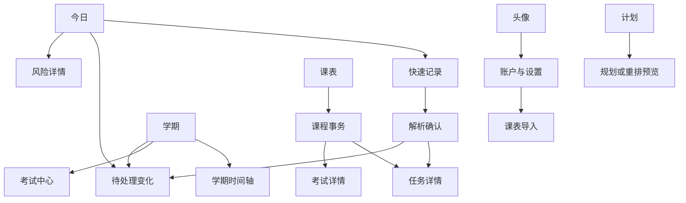

# 学期OS（Semester OS）
## 03｜UI与交互设计 V1.1

> 日期：2026-09-19。依据：01产品需求V1.2、02技术设计V1.1、04测试说明V1.2及05调研记录。
> 用户已选择“校园活力风：色彩丰富、卡片感更强”。本文定义Android首版界面和行为，iOS后续适配；是设计规范，不代表已有高保真页面或真机验证结果。
> V1.1局部修订：强化事项提醒、按情况展开确认页、增加受限自然语言修改、设计匿名演示环境、前置计划余量；保留导航、视觉方向及第15节的固定演示数据。

## 1. 体验目标与视觉方向

用户打开App应快速判断：今天的固定安排、个人计划、尚未解决的变化。AI能力嵌入记录和规划步骤，不要求用户先进入聊天框描述整个人生。

视觉采用暖白底、多色课程卡、清晰时间轴和适量圆角。课程颜色帮助定位，风险颜色表达需要处理的事项，两者不可混用。首页可以有轻量问候与日期，但不用大面积装饰挤占课表和任务。

V1以浅色主题交付，系统深色模式下保持完整浅色配色，避免局部组件随系统变暗造成不可读。深色主题可后续补充，不属于首版必要验收。

### 1.1 设计取舍

| 方案 | 特点 | 本版决定 |
| --- | --- | --- |
| 校园活力卡片 | 多色课程、日常感、关键数字易扫读 | 用户已选；采用 |
| 极简工具列表 | 信息密度高、装饰较少 | 借用列表与表单的清晰度，不改变已选视觉方向 |
| 深色AI工作台 | 强调分析和科技视觉 | 不用于本版，避免把日常课表做成数据大屏 |

## 2. 信息架构与导航

底部固定四个主入口：**今日 / 课表 / 计划 / 学期**。头像进入账户与设置。右下角悬浮“＋记录”按钮是动作，不占第五个Tab；滚动时可收起文字，但保留图标和无障碍标签。



P1的学期复盘、个性化分析没有灰色占位入口；未做的功能不显示为可点击按钮。

### 2.1 页面清单

| 编号 | 页面 | 主要入口 | 完成的任务 |
| --- | --- | --- | --- |
| P00 | 登录、注册、账户恢复 | 首次打开或会话失效 | 建立学期OS账号 |
| P01 | 学期初始化 | 首次登录、切换学期 | 确认学期与时间基准 |
| P02 | 教务导入及预览 | 初始化、设置 | 原站登录、读表、核对和保存 |
| P03 | 今日 | 底部Tab | 查看当天事项、近期风险、待处理变化 |
| P04 | 周课表 | 底部Tab | 课程和其他安排按时间查看 |
| P05 | 计划 | 底部Tab | 查看个人时间块、选择任务生成计划 |
| P06 | 学期 | 底部Tab | 按周看重要节点和负载 |
| P07 | 快速记录 | 悬浮按钮 | 文字、语音、图片、手工输入；个人修改与规划请求 |
| P08 | 解析确认/修改预览 | 记录或修改指令后 | 校对新增字段或前后差异，补充缺失后确认 |
| P09 | 任务/事项详情 | 各列表和卡片 | 看来源、进度、计划和修改 |
| P10 | 课程事务 | 点击课程 | 课程相关作业、考试和课次变化 |
| P11 | 考试中心及详情 | 学期、课程 | 时间、暂定状态、复习目标 |
| P12 | 变化中心及确认 | 今日提示、学期、记录 | 核对通知的变更对象与范围 |
| P13 | 影响分析 | 确认现实变化后 | 查看冲突与余量变化 |
| P14 | 规划/重排预览 | 计划、影响分析 | 比较新旧时间、修改、接受方案 |
| P15 | 风险详情 | 风险提示 | 查容量明细和需要补充的信息 |
| P16 | 来源与历史 | 事项详情 | 看原通知和版本变更 |
| P17 | 账户与设置 | 头像 | 时间偏好、提醒、学期、账号退出 |

详情类默认独立页面；短选项使用底部弹层。原始图片、录音校对和多字段表单不挤在小弹窗里。

## 3. 视觉规范

### 3.1 色彩

| Token | 色值 | 用法 |
| --- | --- | --- |
| background | `#F7F8FC` | 页面背景 |
| surface | `#FFFFFF` | 卡片和表单 |
| text-primary | `#1F2937` | 正文和标题 |
| text-secondary | `#667085` | 辅助信息，不用于禁用状态冒充可操作 |
| primary | `#4F46E5` | 主按钮、选中Tab；白字 |
| course-lilac / ink | `#EBE5FF` / `#57428E` | 紫色课程卡 |
| course-mint / ink | `#DDF4EA` / `#176348` | 绿色课程卡 |
| course-peach / ink | `#FFE3DB` / `#9E3A20` | 橙粉课程卡 |
| course-sun / ink | `#FFF1C2` / `#745000` | 黄色课程卡 |
| risk-high-bg / ink | `#FEE4E2` / `#9F241C` | 高风险与明确冲突 |
| risk-medium-bg / ink | `#FFF1C2` / `#745000` | 余量偏低、不确定安排 |
| info-bg / ink | `#E7EFFF` / `#254A91` | 待确认、解释信息 |

每门课程绑定稳定颜色，不随刷新或排序变化。风险用独立图标与文字“冲突”“余量偏低”，不把整张课程卡染红。课程色、作业状态、计划锁定同时出现时，各占自己的位置。

### 3.2 字体与空间

- 中文采用系统无衬线字体；无需联网下载字体。标题22sp、分区标题18sp、正文16sp、辅助14sp；数字使用等宽数字特性（字体支持时）。
- 正文行高约1.45，主标题不超过两行。长课程名可在课表截断，详情必须完整显示。
- 页面常规边距16dp，卡片内边距16dp，卡片间距12dp；大区块间距24dp。
- 卡片圆角20dp，输入框12dp，标签胶囊形。阴影只用于浮层，常规卡片主要靠底色和间距分层。
- 交互目标至少48dp；最小屏幕以360dp宽测试，另测390、430dp和200%系统字号。
- 手机竖屏优先；横屏不锁死，宽布局仍保留表单和确认按钮。系统状态栏、手势区与键盘使用安全区。

### 3.3 图标与动效

使用统一的圆角线性图标：课程、任务、考试、通知、锁、时钟、来源。图标配文字；麦克风、相机等有无障碍标签，不能只靠颜色识别。

普通页面转场180—240ms，完成提示可轻量缩放。重排以新旧时间卡片对照为主，不用复杂拖动动画隐藏实际改动。系统减少动画时关闭非必要位移。AI处理中显示阶段文字，不显示虚构完成百分比。

## 4. 通用交互规则

### 4.1 信息层级与按钮

每页固定一个主要动作。新增普通手工事项的“保存”本身就是用户确认，不再弹第二次相同确认；AI候选则必须经过字段预览。现实变化和个人重排是两个不同动作，必须分别确认。

保存按钮提交后立即禁用并显示“正在保存”；服务端回执之前不能显示成功。超时显示“正在核对保存结果”，用相同请求查重，避免用户再次点击产生重复事项。

### 4.2 三类信息的表现

| 类型 | 展示 | 可操作 |
| --- | --- | --- |
| 现实固定安排 | 课程色卡 + 课程/考试图标 | 查看、记录变更；无直接AI移动入口 |
| 已接受的个人计划 | 白底或浅课程色 + 任务图标 + 时间 | 修改、锁定、记录进度 |
| 候选或不确定事项 | 文字标签“待确认”“暂定”“时间未定” | 核对/补充；不能用实心正式日程造成误解 |

“用户已确认录入”置于详情审阅信息中；列表仍突出“暂定”。取消事项不占日程，但在历史和课程变化列表可查看。

### 4.3 全局状态矩阵

| 状态 | 展示与操作 |
| --- | --- |
| 首次加载 | 匹配页面结构的骨架，避免屏幕跳动 |
| 缓存存在、刷新中 | 继续展示缓存，标明最近同步时间，不清空整个页面 |
| 空学期 | “还没有课程”，提供导入、手工添加 |
| 暂无个人任务 | “本周还没有待安排任务”，提供记录入口，不显示0%效率 |
| 网络断开 | 显示缓存及“离线”；允许保存本机记录草稿，正式接受按钮不可用 |
| AI不可用 | 原始输入保留，可重试或手工填写；既有课表和普通保存照常可用 |
| 会话失效 | 保存当前记录草稿，重新登录后回到原页；不把教务登录当作App登录 |
| 方案过期 | “安排有变化，需要重新计算”，显示变化摘要和重新计算按钮 |
| 来源文件已删除 | 显示历史记录及“原文件已删除”，不展示失效缩略图 |
| 空接口响应或未知格式 | “暂时无法读取课表”，保留旧课表，不能解释为全部停课 |

用户退出有未保存内容的表单时，提供“保存草稿 / 放弃修改 / 继续编辑”；无修改则直接返回。长作业运行中退出页面保留作业，只有点击“取消解析/生成”才发送取消请求。

## 5. 注册与首次使用：P00—P02

### 5.1 账户

登录页展示作品名称、用户名、密码、登录和注册入口。学校账号不出现在学期OS注册表单。注册后展示一次性恢复码及“我已保存”，允许复制，但不自动复制到剪贴板；恢复入口使用用户名+恢复码+新密码。

错误贴近字段，登录失败不暴露账户是否存在。退出账号后清理日程缓存和教务会话；提示属于当前账号的未同步草稿数量，让用户选择先同步或明确放弃，不能切换后混入新账号。

### 5.2 初始化顺序

注册/登录 → 创建学期 → 导入课程 → 校对周次和节次 → 设置可学习时间 → 今日。

创建学期填写名称、第一周周一、总周数；学校无法提供时显示“需要你确认”，不给未经核实的学校校历。时间偏好提供可编辑示例值，并要求用户保存确认，不把示例当实际可用时间。

导入可暂时跳过，之后从空态或设置继续。跳过不会删除学期，也不在每次打开App时强制重新引导。

### 5.3 教务登录与导入

原站WebView上方只保留“返回、河南工业大学、网站域名、帮助”；底部工具栏显示“读取课表”。学校页面可正常缩放，不重绘学校密码框。未到课表页时按钮旁提示“登录后进入个人课表查询”。

以上为正常产品环境。比赛演示使用下节的独立示例入口，不在演示模式加载含真实校名/Logo的教务网页。

读取成功进入同一张导入预览页：显示学期OS目标账号、学期、课程数量、周次、节次和地点；服务端校验后在本页更新新增/变更差异，避免重复展示两次内容相同的确认页。

主按钮：“确认导入X门课程”。有缺失节次、无法匹配课程或来源缺席时展开待核对列表；需要用户处理后才能应用受影响项，其余项允许明确分批导入。

失败时给出可执行路径：重新进入课表、切换学年学期、重试读取、图片/手工导入。不能将“换个账号”作为默认错误建议，也不要求把教务密码发给开发者。

### 5.4 比赛匿名演示环境

使用同一套界面和业务逻辑，演示账号进入独立数据环境；不新增底部Tab，也不维护一套假业务页面。

| 项目 | 正常产品 | 比赛演示 |
| --- | --- | --- |
| 课表入口 | 河南工业大学原始教务网页 | 示例高校课表，标注“演示数据” |
| 导入动作 | 用户真实认证后读取本人课表 | “导入示例课表”，没有假登录表单 |
| 来源与账号 | 本人真实数据，按权限查看 | 合成姓名、账号、截图、来源与历史 |
| 规划与风险 | 真实服务及算法 | 相同服务及算法处理演示数据，不预置结论 |
| 时钟与提醒 | 真实时间，可启用系统通知 | 标注演示日期；默认仅显示“演示提醒”预览 |

仅改顶部校名不够：原始截图、来源详情、录音转写、历史、URL、文件名和错误信息也要经过匿名检查。比赛演示不打开真实学校WebView，因此不需要临时遮住真实登录页；真实教务读取另行留存验收证据。

演示账号不能访问正常账号数据，重置只恢复演示夹具。演示模式与合成数据不隐藏；AI不可用时仍展示真实失败和手工入口，不能悄悄换成预置解析成功。

## 6. 今日首页：P03

从上到下：日期与第几周、待处理变化（有才出现）、今日固定安排、今日个人计划、近期重要事项。主标题可用“今天，按自己的节奏来”，但不能替代日期和日程。

```text
┌──────────────────────────────────┐
│ 9月21日 周一 · 第4周        头像  │
│ 今天的安排                       │
│ [有1条变化需要处理      查看 →]   │
│                                  │
│ 固定安排                         │
│ [08:00 概率论       A305  课程色] │
│ [14:00 操作系统     B204  课程色] │
│                                  │
│ 个人计划                  全部 → │
│ [21:00 Java报告 · 1小时      ⋯]  │
│                                  │
│ 近期提醒                         │
│ [Java报告 周五截止 · 剩余3小时]  │
│ [计划余量5小时 · 当前余量充足 →] │
│ [下次提醒：周四23:59       修改] │
│                        [＋记录]  │
│ 今日      课表      计划     学期 │
└──────────────────────────────────┘
```

以上为布局线框，课程条目仅示意，不是第15节演示夹具的数据。

- 待处理变化卡片显示“什么发生变化、影响几项计划”，不只写“AI发现问题”。
- 任务卡主行标题，次行计划时间与截止；锁定图标在时间旁。完成入口标“记录进度”，避免一碰时间块就误将整个任务完成。
- 当天没有固定安排时写“今天没有已记录的固定安排”，避免断言“今天完全空闲”。
- 多条风险只优先显示最需要处理的两条，其余进入完整列表；信息不足与高风险分别标记。

### 6.1 任务卡上的计划余量

今日、计划与课程事务中的任务列表卡，直接显示“截止时间 · 预计剩余”及一行更醒目的“计划余量”，点击进入风险详情，不要求先打开任务详情再找分析入口。每个任务展示的是该任务的余量，不能把单个1小时时间块的时长当作任务全部剩余工作量。

- 数据充分且无其他风险：“计划余量5小时 · 当前余量充足”。
- 存在直接冲突：“计划余量3小时 · 时间冲突”；余量为正不能遮住冲突。
- 同窗口总体不足：优先显示“同期任务至少缺2小时”，可同时保留单任务余量供解释。
- 耗时未知：“补充耗时后查看余量”；数据过期：“余量正在更新”；不能用0或旧数字填满卡片。
- 余量等级来自02的`risk-v1`。剩余3小时、余量1.5小时，在无其他风险时不能仅为显眼标为“偏低”。

数字用18sp和深色强调，状态用图标与文字，避免整张课程色卡变成风险色。周课表窄格只保留冲突标记，完整数字放在任务列表/详情，不把七列课表挤成仪表盘。

### 6.2 提醒的日常入口

今日近期事项显示下一次有效提醒的具体日期/时间和“修改”入口；没有提醒时显示“添加提醒”。系统通知权限关闭时附“系统通知未开启”，不隐藏已经保存的App内提醒规则。详情内始终可管理完整提醒列表，不新增提醒中心Tab。

## 7. 周课表与课程事务：P04、P10

### 7.1 周课表

顶部为学期、第几周、上/下周和“回到本周”；下方切换“周视图 / 日列表”。默认周视图显示周一至周日，时间轴固定，今天有轻量描边。

- 周列最小48dp、时间轴36dp；窄屏允许横向滚动并固定时间轴，不能压缩触控区以强塞七列。常规课表区边距可缩至8dp。
- 课程按实际起止时间定位，节次是辅助标尺；晚间活动不能挤进虚假的课程节次。
- 同时段真实冲突并列显示并加“冲突”标记，不能盖住另一项。点击区域弹出该时段事项列表。
- 正常课次实心浅课程色；停课在“显示变更记录”时用划线/空心卡呈现；新课次标“调课/补课”。历史卡不作为占用。
- 原始周次可显示“第1—16周·单周”；详情展示具体实例日期。
- 超长名称在格内最多3行；日列表显示完整名称。字号放大时推荐日列表，同时保留周视图入口。
- 不支持直接拖动学校课程。长按课程弹出“查看详情 / 记录调课或停课”；拖动个人计划只能进入校验后的修改预览。

### 7.2 课程事务

标题区：课程名、教师、地点摘要和颜色。下方分区为“待办任务 / 考试 / 上课与变更记录”。默认优先展示未完成作业，不加入笔记、讲义或课程答疑入口。

点课次查看本次日期、原安排、当前安排、来源；点作业进入任务详情。新增按钮默认带入课程，但用户可清除或换课，不让相近名称自动绑定后无法纠正。

## 8. 快速记录与确认：P07、P08

### 8.1 输入界面

悬浮按钮展开文字、语音、图片、手工四个入口；默认文字页，文本框占主要空间，提示“记一件事，或修改任务和提醒”。粘贴为用户主动动作，不监听微信/QQ或自动读取剪贴板。自然语言修改仍通过同一入口进入预览，不另设聊天Tab。

语音采用“点击开始 / 点击结束”，不用只支持长按的隐蔽手势。首次使用申请麦克风权限；录音中显示真实秒数，120秒自动结束并保留录音。退后台停止录音并保存草稿，不在后台继续录制。

图片优先系统选择器，拍照另行申请权限。显示所选缩略图，允许替换和取消；格式/大小不合要求在上传前说明。V1一次一张，可在解析后识别多个事项。

### 8.2 解析过程

阶段文案：“已保存输入 → 正在识别 → 正在整理事项 → 请核对”。阶段未知时使用“处理中”，不编造“完成82%”。可离开页面，结果进入草稿入口；取消后即使服务端返回，也不自动生成正式事项。

识别失败保留原输入，按钮为“重试 / 改用手工填写”。语音显示转写结果并可播放原音频；纠正转写后可重新解析，旧结果不覆盖用户已修改字段。

### 8.3 按情况展开的确认页

```text
┌──────────────────────────────────┐
│ ← 核对事项                       │
│ Java实验报告                 编辑│
│ Java程序设计                     │
│ 9月25日截止 · [核对截止时间]     │
│ 已识别：预计剩余3小时        修改│
│ 提醒：提前1天 · 待确认触发时间   │
│                                  │
│ [需核对：原通知未给具体时刻]     │
│ 更多设置 ▾                      │
│                                  │
│ [保存草稿]      [确认添加]        │
└──────────────────────────────────┘
```

- 点字段旁来源标记可定位原文或图片区域。用户无需看到模型名、JSON或置信度小数。
- 缺失与AI推断使用文字标签，正式保存前逐项处理必要字段；不必要字段可保留未知。
- 截止只知道日期时，展示“按当天结束前规划”的可确认选项，并说明原通知未给出具体时刻。
- “暂定第14周考试”允许确认保存暂定事项，时间仍显示“第14周，具体日期待定”；可单独选核实通知日期。
- 多事项通知按卡片逐项勾选，显示待补充数量；已选且满足相应保存条件的项可确认，未选/不完整项保留草稿，不静默丢弃。
- 同名或可能重复事项显示“可能已记录”，提供查看、合并确认或另建；不自动跨课程合并。
- 调课通知在此进入变化确认，主按钮写“查看变更”，不能像普通任务一样直接新增一门课。

默认直接展示标题、所属课程（若有）、截止/事项时间、提醒摘要。类型用短标签表达，只有匹配不确定时才要求选类型；不要求用户每次浏览八九个等权重字段。

“更多设置”包含耗时编辑、是否拆分、更多提醒及来源全文；本版不新增手动优先级。来源核对标记仍可直接点击，不能把关键证据完全藏起来。用户在输入中明确提供的耗时必须进入摘要；AI推断、日期歧义、重名匹配等关键核对项始终展开，不因简化界面被隐藏。

“周五交Java报告”未提供耗时时，可以先保存为已记录任务，摘要显示“耗时未填，暂不能自动规划”。保留缺失值，不填默认3小时，不显示精确余量；之后从任务卡补充耗时再规划。

默认提醒显示为“提前1天（周四23:59） · 修改”之类可复核摘要。时间锚点未明确或默认触发时刻已过去时直接提示，用户可选择其他时间或明确先不设置提醒后保存事项；不能显示已启用但实际上没有触发时间的成功状态。

“简单任务2秒确认”仅是体验目标，不是已测得结论。测试从解析结果可交互时开始计时，统计最终正确保存耗时及修正字段数；模型识别耗时另行记录。

### 8.4 自然语言修改与规划请求

识别为修改后，P08展示“修改预览”，而不是再次添加同名任务。主区包含明确的目标事项、原值、新值及受影响内容，按钮为“确认修改”；多个同名项先显示课程与截止供选择。同一事项有多条提醒时，还要明确选中哪条，不能把“改提醒”解释成覆盖所有提醒。

```text
Java实验报告 · 9月25日截止
修改提醒
原：截止前1天（9月24日23:59）
新：指定9月24日20:00
提醒用途：提交报告
[返回修改]  [确认修改]
```

只有用户说出了具体时刻，或采用其已确认且展示出来的时间约定，才能出现上面的20:00。输入“提醒改成周四晚上”而无约定时，预览显示“选择具体时间”，不能擅自填20:00。

V1支持个人任务标题/剩余耗时/拆分设置修改、提醒增改停用，以及请求安排或重排个人任务。不支持自然语言批量删除、自动解锁、自动标记完成或静默改变学校规定的截止时间。

- “概率论复习再加一个周日下午的计划”：先核对是哪项复习、具体时段与时长，是安排现有剩余工作还是增加目标；随后进入计划预览，不能保存一段无时长日程。
- “把今晚没做完的任务重新安排一下”：显示候选任务和剩余工作量让用户选择；未点完成不等于实际未完成。生成重排建议后另行确认应用。
- “把概率论改到周五”：提示选择修改个人提醒、复习计划还是记录调课通知；选择调课后走现实变化的来源与范围确认。
- “把概率论考试提醒改到周四20:00”：目标唯一、日期明确时直接展示提醒差异，不重复询问已经明确的操作类型。

修改前数据已变化时提示“这项内容刚有更新，请重新核对”，不强制覆盖；取消修改保留原值。所有正式改动沿用手工界面的约束与来源记录，模型不直接操作数据库。

## 9. 计划中心与任务进度：P05、P09

### 9.1 计划中心

顶部选择日期范围，默认未来7天，可选14/28天；中部按天展示已经接受的个人时间块，并可折叠查看固定安排；未安排任务单独成区。

“生成计划”先打开目标面板：范围、纳入任务、已有覆盖、本轮目标分钟、后续剩余、时间偏好摘要。窗口内截止任务默认全部纳入；更远截止任务只按用户确认的本轮目标安排。不能把未选择的任务算作完成规划。

任务列表可修改预计剩余时长与拆分方式。锁定可按时间块操作；任务详情提供“锁定该任务所有未来计划”，执行后显示受影响块数。

### 9.2 进度与完成

任务详情同时显示“预计剩余”“已安排”“已确认完成情况”，不把三者画成同一条进度。

点“记录进度”后可选择：修改剩余工作量、记录实际用时、标记整个任务完成。记录实际用时30分钟不自动意味着剩余工作量减少30分钟，用户可另行确认。

标记整个任务完成前展示将释放的未来时间块。按钮文案：“完成任务并取消后续X段计划”。锁定块也明确列出，只有该次用户确认才能取消；不能后台解除锁定。只完成某段计划时不默认整个任务完成。

过了计划时间但未更新状态，显示“这段计划的进度待确认”，可记录完成、修改剩余或重新安排，不标注“你没有完成”。

### 9.3 事项详情中的提醒

任务、考试及其他有提醒需求的事项详情，提供可见的“提醒”区块，位置在时间/截止信息之后、历史与来源之前。例如：

```text
提醒
截止前1天 · 9月24日23:59     修改
截止前2小时 · 9月25日21:59  修改
＋ 添加提醒
```

每条可单独修改或停用；“＋添加提醒”支持相对时间与指定时刻。预设是选择项，不自动全部开启。过去的触发时间显示“已错过”，允许换时间，不自动立即补发。完成任务或取消事项的确认页同时说明后续提醒将停止。

## 10. 变化中心、影响与重排：P12—P14

### 10.1 变化确认

变化中心区分“待核对通知 / 已更新但计划待处理 / 已处理”。每项展示课程或事项名、原时间、新时间、作用范围与来源。

作用范围用明确单选：仅本次、指定周次、从某周开始的后续课次。默认不预选整个学期。没有具体日期或结束时间时提示补充；不能仅凭“改到周五19:00”直接应用。

确认按钮：“确认更新课程安排”。说明：“之后会检查对个人计划的影响。”范围与来源冲突必须解决后才能更新对应项。

### 10.2 影响分析

先显示“课程安排已更新”，再展示：直接冲突、锁定冲突、容量变化、未受影响的计划数量。只影响个人计划时可进入重排；没有冲突则显示无需重排，可另选提前安排高风险任务。

锁定冲突示例：“周六14:00的计划已锁定，与新考试时间重叠。”按钮为“查看锁定计划 / 解锁后重新规划”，不提供默认选中的自动解锁。

### 10.3 重排预览

```text
┌──────────────────────────────────┐
│ ← 调整个人计划                   │
│ 概率论调课影响了1项任务          │
│ [移动1项任务] [其余2段保留]      │
│                                  │
│ Java实验报告 · 1小时             │
│ 原：周五 19:00—20:00             │
│ 新：周四 21:00—22:00             │
│ 原因：避开已确认课程，截止前完成 │
│ [修改时间]                       │
│                                  │
│ 锁定计划保留 · 无新增时间冲突    │
│ [放弃方案]       [应用调整]       │
└──────────────────────────────────┘
```

数字必须来自方案指标，只统计同一范围。没有证明最优时写“尽量保留原计划”，不写“这是唯一最优方案”。普通用户不必看到求解器状态码。

修改单项时间后按钮进入“检查安排中”，通过校验才能接受；候选的其他项如被联动改变必须再次展示。离开预览不改变正式计划，已确认的课程调课仍然有效。

### 10.4 不能全部安排的情况

| 情况 | 文案与动作 |
| --- | --- |
| 真实时间不足 | “截止前至少还缺2小时”，展示需求和容量；调整任务目标、可用时间或查看可安排部分 |
| 当前拆分方式无法放入 | “现有连续时段放不下，试试调整拆分方式”，不等同于所有安排方式都无解 |
| 锁定与现实冲突 | 保留两项现实信息，用户明确解锁后再计算 |
| 暂时没算出方案 | “本次计算未完成”，保留旧计划，重试或缩小范围 |
| 部分方案 | 顶部与底部均显示未安排工作量；按钮“应用可安排部分，仍有X小时待安排” |
| 原数据已变化 | “课程或任务刚有更新，请重新计算”，不允许强制覆盖 |

取消和拒绝建议不删除任务。用户若坚持手工记录有冲突的固定现实事项可以保存并显示冲突；个人计划不能通过手工入口绕过相同硬约束校验。

### 10.5 应用与撤销

保存成功后今日、课表、计划和学期同时刷新到同一日程版本。提示“已调整1项任务”，提供“查看计划 / 撤销此次调整”。最近一次调整也可从计划页历史进入，不只依赖短暂Snackbar。

撤销不恢复学校旧安排。若原个人时段已被新课程占用，提示“原时间现在有课程，无法直接恢复”，提供重新规划；不能在用户按撤销后隐藏新冲突。

## 11. 学期、考试与风险：P06、P11、P15

### 11.1 学期时间轴

按周纵向展示，顶栏可选“全部 / 作业 / 考试 / 变化”；当前周置顶可回到学期开始。每周显示重要截止、考试、变化数量和基于记录的负载摘要。

没有足够耗时数据时显示“部分任务未填写耗时”，不展示看似精确的负载百分比。近期风险由服务端计算，不能仅以卡片数越多就越高风险。

高负载周展开后可看容量明细与未安排任务；考试中心有独立入口，方便快速找到全部考试，不必逐周寻找。

### 11.2 考试中心

列表按正式时间、暂定范围、未知时间分别呈现。卡片包含课程、时间、地点、暂定标签和复习状态。

详情提供“设置复习目标”：轻量、标准、充分和自定义都展示明确分钟/小时，并允许编辑；初始示例2/4/8小时仅为用户选项，不是模型对考试难度的判断。选择后显示将新增或修改的复习任务，不能重复创建一套同考试复习任务。

考试在28天内可选择安排到考试前；更远考试提示先设阶段目标，保留总剩余工作量。只有“第14周”的考试不能生成精确倒计时，应先核实具体时间或手动设阶段复习目标。

考试提醒紧邻考试时间：可选提前14天“开始复习”、7天、1天、2小时，每项显示具体日期与启用状态，不默认全选。点“开始复习提醒”只设置提醒，旁边另有“设置复习目标”入口，避免把提醒误认为已排好复习。

考试改期后相对提醒随新考试时间更新，过去的提醒不补发；指定时刻的提醒不悄悄平移，若已不适合原用途则显示“需要核对”并暂停该条系统安排。只知道考试周时可添加明确日期的“检查正式通知”，不把整个考试周当作精确锚点。

### 11.3 风险详情

标题直接回答原因，如“周五前的可用时间变少了”。从上到下：

1. 计算区间与最近计算时间；
2. 可学习时段、固定占用、其他计划占用；
3. 当前任务剩余工作量与单任务余量；
4. 同窗口任务的总需求和容量缺口；
5. 缺失信息或暂定预留；
6. 查看冲突、修改耗时、生成计划等对应动作。

用时间条与数字对照解释，不使用无来源的“延期概率85%”。“余量充足”附“根据已记录安排”，不评价学习效率。

展示计算步骤时统一口径，以下只是独立的公式示例，不替换第15节演示数据：

```text
截止前可学习容量（已扣固定安排）  6.0小时
其他任务计划占用                1.5小时
当前任务剩余工作量              3.0小时
──────────────────────────────────────
计划余量                        1.5小时
```

6.0小时尚未扣除其他任务，不能把已经扣过其他任务的“本任务可用时间”再次减1.5小时。该例在无其他风险时不标“偏低”；等级取自服务端规则。总体窗口缺口和直接冲突另列说明，不用这个单任务结果覆盖它们。

## 12. 来源、设置与权限：P16、P17

来源详情可看原文字、图片或录音，并跳到当前字段对应片段。历史按时间排列，显示“用户确认调课”“用户手动修正”“个人计划重排”等动作；来源类型与操作者分开。

设置分为账户、学期、可学习时间、提醒、数据与来源。时间偏好支持按星期配置、禁排时段、建议块长、允许拆分和周末安排。保存新时间偏好若影响既有计划，显示影响摘要，引导重排；不静默移动任务。

通知权限在首次启用提醒时申请。拒绝后显示“系统通知未开启，App内仍可查看提醒”，不阻止其他功能。Android权限和后台调度能力有限，界面只显示本机设置状态，不宣称系统通知一定送达。[平台依据](https://developer.android.com/develop/ui/compose/notifications/notification-permission)

“检查正式通知”是用户指定日期的独立提醒；修改课程、考试或取消事项时更新相应提醒。提醒详情可以查看最近同步时间。

## 13. 无障碍与输入边界

- 正文与按钮文字设计对比度至少4.5:1，课程色卡使用表中深色配对；实现后检查实际叠色和禁用态。
- 屏幕阅读器按日期、事项名、时间、状态、动作顺序朗读；纯图标按钮必须有名称。
- 时间线不作为唯一查看方式；日列表提供相同完整内容。字体放大不能隐藏主操作或把关键时间截断。
- 键盘弹出时保留当前字段与主操作，长表单可滚动；下一项/完成动作符合输入类型。
- 日期选择器限制与时间精度一致，不能用精确日历强迫“暂定第14周”选一天。
- 错误文字指向具体问题，如“结束时间要晚于开始时间”；不只用Toast写“参数错误”。
- 语音、图片均有文字/手工替代路径；用户拒绝权限不进入循环授权弹窗。
- 原始学校网页属于第三方内容，App负责外层导航与读取提示，不承诺改造其所有可访问性问题。

## 14. 页面与技术合同对应

| 页面/动作 | 02中的合同 | 关键约束 |
| --- | --- | --- |
| 注册和恢复 | `/auth/register`、`/auth/recover` | 不使用学校凭证作为App注册 |
| 教务导入预览 | `/imports`、`/imports/{id}/apply` | 本地原站认证；服务端差异确认 |
| 快速记录 | `/sources`、`/sources/{id}/parse`、`/jobs/{id}` | 来源先保存，解析不等于正式新增 |
| 解析确认 | `/candidates/{id}/confirm` | 时间精度与审核分离 |
| 自然语言修改 | `/operations/{id}`、`/operations/{id}/apply`、`/operations/{id}/reject` | 目标匹配、前后差异、版本检查；规划请求仍需方案确认 |
| 事项提醒 | `/reminders`、`/reminders/{id}` | 一事项多条规则，模式/具体时刻可核对；保存不等于送达 |
| 任务详情/进度 | `/tasks/{id}`、`/tasks/{id}/progress` | 工作量与实际用时分开 |
| 变化确认 | `/changes/{id}/apply` | 明确对象、版本和生效范围 |
| 生成与重排 | `/planning/jobs`、`/proposals/{id}` | 目标范围明确，计算状态真实 |
| 修改/接受方案 | `/proposals/{id}`、`/proposals/{id}/accept` | 重新校验；过期方案不可接受 |
| 锁定/解锁 | `/plan-blocks/{id}/lock` | 用户明确动作，使旧候选过期 |
| 撤销 | `/proposals/{id}/undo` | 不撤销已确认现实通知 |
| 今日/课表/学期 | 学期查询投影接口 | 同一修订号，更新后共同刷新 |
| 来源/风险 | `/sources/{id}/content`、学期`/risks` | 鉴权和计算依据可追溯 |

## 15. 可复核的演示数据

以下是合成演示夹具，必须标注“演示数据”；不代表学校真实校历或用户试用。测试时固定App的演示时钟，正式用户数据使用真实时间，不共用隐藏的模拟时钟。演示按5.4节使用独立示例课表入口，真实读取另行验收；基于模拟时钟的提醒只作标明用途的App内预览。

### 15.1 基础场景

- 当前时刻：2026-09-21周一18:00，时区Asia/Shanghai。
- 演示学期第一周周一：2026-08-31，因此当前为第4周；这是演示配置。
- 用户确认可学习时段：周一至周五19:00—22:00，截止前合计15小时。
- Java报告：2026-09-25周五23:59前提交，预计剩余3小时；初始个人计划为周一21:00—22:00、周二21:00—22:00、周五19:00—20:00。
- 其他7小时已安排任务：周一19:00—21:00、周二19:00—21:00、周三20:00—21:00、周四19:00—20:00、周五21:00—22:00；均在同一截止前，输入中保存具体任务ID。
- 概率论本次原课程：周三08:00—10:00，位于用户禁排个人学习时段。
- 将周二21:00—22:00的Java计划锁定，用于展示重排保留。

### 15.2 变化与结果

完整通知：“本次9月23日周三08:00—10:00的概率论，调整至9月25日周五19:00—21:00，教室A305，仅调整本次。”

用户确认后：

| 指标 | 变化前 | 变化后 |
| --- | --- | --- |
| 固定占用扣除后的可学习容量 | 15小时 | 13小时 |
| 其他已安排任务 | 7小时 | 7小时 |
| Java报告可使用时间 | 8小时 | 6小时 |
| Java报告剩余工作量 | 3小时 | 3小时 |
| Java报告单任务余量 | 5小时 | 3小时 |
| 全部任务工作量 | 10小时 | 10小时 |
| 窗口工作量缺口 | 0小时 | 0小时 |

期望一个可行重排：将Java周五19:00—20:00移至周四21:00—22:00，另外两段保留，周二锁定段不动。该方案移动1项任务、1个时间块，时间偏移22小时（1320分钟），未安排工作量为0。

以上是预期可行结果，不提前宣称求解器一定输出该解或证明其全局最优。演示由真实算法生成结果；若有等效方案，按实际结果展示，不在UI硬编码“只移动一项”。

本案例的余量下降来自新课程占用可学习时段，旧课释放时间不属于可学习范围。虽然余量仍为正，新课程直接撞上既有Java计划，仍需要调整。另设等长课程在两个可学习时段互换的对照用例，允许余量不变。

### 15.3 边界状态夹具

- 暂定考试：“概率论考试暂定第14周，具体日期另行通知”；确认后仍显示暂定。
- 容量不足：同一截止前4小时可用，两个任务各3小时；显示至少缺2小时。
- 锁定冲突：新考试直接占用锁定计划；显示冲突，不自动移动。
- 旧方案过期：预览期间改变任务剩余耗时；接受时提示重新计算。
- 记录失败：模拟AI不可用；保留原文并完成手工记录。

新增边界夹具：耗时未知的轻量记录；周四晚上缺少具体时刻的修改；考试改期后部分提醒过期；单任务余量正但整体不足；自然语言修改预览后目标版本变化。具体输入和期望见04的TC-020—034，不改动15.1—15.2的时间、工作量和预期重排。

## 16. UI验收与交付边界

验收依据为真实Flutter界面与Android真机操作，线框图、静态截图或接口测试不替代交互验收。

- 四个主Tab与所有P0详情入口可达；Android返回键不会误退出或重复保存。
- 360/390/430dp宽度、系统字号放大、键盘与安全区下，主操作可见且可点击。
- 文字、录音、图片、手工均能完成各自输入路径；失败保留可恢复草稿。
- 暂定、待确认、取消、锁定、冲突在视觉与文字上可区分。
- 现实变化与个人重排分别确认；退出重排不撤销已确认通知。
- 接受、部分接受、过期、超时、无解、撤销失败均有真实可操作页面。
- 首页、课表、计划、学期显示同一批数据，不靠切页触发临时修正。
- 账号切换后不显示上一用户数据，未同步草稿处理明确。
- 课程颜色稳定，风险不只靠颜色表达；日列表与周视图信息一致。
- 演示录屏去除参赛学校身份信息，合成数据标注明确；统计数字来自实际运行结果。

V1.1补充验收：重要事项有提醒区块、确认页可改默认提醒；简单录入不强迫补耗时，关键歧义不被折叠；自然语言修改先预览再应用；演示页及来源无真实学校身份且不假装认证；任务卡直接显示真实计划余量和优先级更高的冲突/缺口。阶段文字、不虚构进度百分比、AI失败后基础事务可用等原有要求继续保留。

后续高保真实现先覆盖P03今日、P08解析确认、P14重排预览三页，以统一组件验证校园活力风，再扩展其他页面；不在此阶段新增聊天、社交、笔记或资料库功能。
