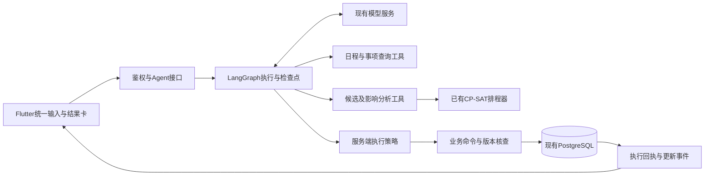

# V2 技术选型与 Agent 架构

调研日期：2026-09-21至22。本文区分仓库已实现能力、官方文档支持和待集成验证的候选方案。没有安装新生产依赖，没有更换模型或访问真实用户日程。

## 1 建议选型

| 能力 | 建议 | 依据与取舍 | 当前状态 |
| --- | --- | --- | --- |
| Agent编排 | LangGraph为首选验证对象 | 需要暂停确认、恢复、多步工具状态；使用PostgreSQL持久化，不引入托管平台作为必需依赖 | 文档核查，尚未集成 |
| Agent备选 | PydanticAI | 与现有Pydantic业务类型契合，具备工具与延迟确认机制；作为独立备选，不与LangGraph叠加 | 文档核查，尚未集成 |
| 模型 | 保留配置中的deepseek-flash | 官方工具调用示例支持该模型名；先验证现有供应商兼容性，不为框架示例换模型 | 当前文本调用已存在，Agent调用未验证 |
| 排程 | 复用OR-Tools CP-SAT | 仓库已有scheduler/replanner，扩充固定日程、偏好和结果解释 | 已有9.15.6755依赖，不重新造求解器 |
| 日程UI | calendar_view 2.0.0优先做隔离验证 | 有日／周／月与自定义视图，MIT；官方提示2.x必须精确锁版本 | 未替换现有Flutter网格 |
| 日程UI备选 | kalender | 交互与视图能力丰富，但官方仍提示1.0前小版本可能破坏兼容性 | 仅备选，不以功能多判定更成熟 |
| 本地状态 | 继续Flutter、Riverpod、Drift与现有路由 | 重构数据复用和状态范围，而非为了改版更换客户端技术栈 | 依赖已存在，当前部分控制器仍为ChangeNotifier |
| OCR／语音 | 先保留RapidOCR与SenseVoice现有服务 | 已有工程与实际链路验证；模型视觉输入作为后续对照候选 | 本轮不替换识别服务 |
| 动效 | Flutter原生转场与局部隐式动画 | 先满足交互反馈与性能；没有明确素材需求前不引入额外动效引擎 | 设计建议 |

选型是基于需求匹配的建议，不是独立性能实测结论。框架和模型的确切组合应在隔离环境生成锁文件，记录版本、传递依赖、许可证和实际调用结果后再接入主服务。不安装“latest”后直接覆盖生产requirements.lock。

## 2 官方证据及局限

LangGraph文档说明检查点可保存执行状态，并提供PostgreSQL持久化；内存检查点不能跨进程重启恢复。[持久化文档](https://docs.langchain.com/oss/python/langgraph/persistence) 人工确认可以使用interrupt，但恢复会重新执行所在节点的部分逻辑，因此不能在确认前放不可重复的业务写入。[中断文档](https://docs.langchain.com/oss/python/langgraph/interrupts) 核心项目为MIT许可。[许可证](https://github.com/langchain-ai/langgraph/blob/main/LICENSE)

PydanticAI支持延迟工具请求及收集结果后继续执行，也明确指出工具确认不能替代应用鉴权。[Deferred Tools](https://pydantic.dev/docs/ai/tools-toolsets/deferred-tools/) 官方提供DeepSeek provider，但其示例模型名与当前项目配置可能不同，应以供应商实际支持与本项目实测为准。[Provider文档](https://pydantic.dev/docs/ai/models/openai/#deepseek) 核心项目为MIT许可。[许可证](https://github.com/pydantic/pydantic-ai/blob/main/LICENSE)

DeepSeek官方工具调用示例使用deepseek-flash；工具由应用执行，结果再交回模型。strict功能需要特定配置且有Schema限制，不能假设打开后无需服务端校验。[Tool Calls](https://api-docs.deepseek.com/guides/tool_calls/) V2第一批优先保持当前Chat Completions协议，保存真实工具调用和结果，不自行伪造调用插入历史。Responses迁移不是Agent实现前提。

calendar_view官方有日、周、月视图与事件管理；2.x明确要求精确锁定版本。[包说明](https://pub.dev/packages/calendar_view) [版本记录](https://pub.dev/packages/calendar_view/changelog) [MIT许可证](https://pub.dev/packages/calendar_view/license) 这些信息不能证明中文长标题、大字号、同一时段多门课程在我们的App中已经显示正确。

kalender官方说明支持多种视图、拖动与时区，并提示1.0前破坏性变更可能出现。[包说明](https://pub.dev/packages/kalender) [许可证](https://pub.dev/packages/kalender/license) 因此先比较能否禁用固定日程拖动、是否支持我们的布局，而非直接全量替换。

OR-Tools支持约束求解；CP-SAT返回FEASIBLE不等于证明OPTIMAL。[官方状态说明](https://developers.google.com/optimization/cp/cp_solver) 沿用现有求解器时仍应保留耗时限制、可行性核查与真实状态，不向用户把所有候选称为“最优方案”。

本轮只读取上述官方资料，没有采信供应商性能宣传作为我们的性能结果，也没有进行详尽学术查新。

## 3 为什么推荐一个 Agent 加业务工具

采用一个具有工具权限边界的日程Agent。查询、提取、规划可以是图中的不同节点，但没有必要先部署多个互相对话的Agent。多个模型角色会增加延迟、成本和状态同步复杂度，当前需求没有证明需要它们。

推荐边界：框架负责模型与工具执行流程、暂停恢复；业务服务负责身份、事实、约束和写入；OR-Tools负责可行时间安排；Flutter负责展示与用户操作。模型不能直接执行SQL、任意HTTP或模拟点击手机屏幕来修改数据。

应用不要求购买LangSmith或其他托管平台才能运行。日志默认留在自有服务，第三方追踪应另行评估数据内容与成本。

## 4 一般固定日程与统一读模型

建议增加独立`ScheduleEvent`实体，避免把会议塞入现有作业／任务／考试枚举。学校课程保留现有CourseMeeting及课次展开，考试继续使用既有专属模型规则，个人计划仍为PlanBlock。界面读取统一投影，底层来源模型不强行合并。

建议字段：`id/user_id/semester_id/title/start_at/end_at/time_precision/date_range/timezone/certainty/location/lifecycle/source_id/version`。user_id由鉴权上下文决定，不能取自模型参数。时间统一保存UTC并带来源时区，当前默认Asia/Shanghai。lifecycle为active/cancelled；certainty为confirmed/tentative/unknown。

统一投影`CalendarEntry`包含`resource_type/resource_id/occurrence_id/title/start_at/end_at/due_at/time_precision/location/fixed/source_ref/version`。事件区间采用左闭右开，17:00结束与17:00开始不构成时间重叠；通勤／休息缓冲是显式偏好，不藏在重叠公式里。

`resource_type`区分course、event、exam、plan、deadline。截止节点只填due_at；未确定具体时间放到单独的undated集合。课程的周次、单双周与调课规则由原有occurrences服务解释。聚合视图不能生成第二份可编辑的课程事实。

明确开始但没有结束的活动可以先保存为待补充日程，不猜持续一小时。在安排窗口涉及该活动可能占用的日期时，询问结束时间或由用户明确预留范围；不把它当成零占用，也不让一个不相关月份的待确认活动阻断本周排程。暂定时间的预留策略在界面可见。

固定日程必须接入提醒、冲突、余量、排程、修改／取消、来源和时间轴。语义上的“固定”表示Agent不能自行移动，用户仍可以根据新通知明确修改。

## 5 工具契约

所有工具调用注入服务端`ActorContext(user_id, semester_id, session_generation)`。按需提供相关工具，不把完整所有CRUD字段暴露给模型。

| 工具 | 核心输入 | 返回 | 写入规则 |
| --- | --- | --- | --- |
| `query_calendar` | 时间范围、类型筛选 | CalendarEntry及revision、完整性 | 只读，跨学期查询须显式范围 |
| `find_items` | 标题词、日期、类型 | 有权限的候选对象及消歧标签 | 只读，不凭标题直接写入 |
| `get_source` | 来源引用 | 原文、原消息时间、版本 | 只读取当前用户拥有的来源 |
| `analyze_schedule` | 范围、关注问题 | 指标、依据ID、未知项 | 只读，模型不得补造指标 |
| `find_free_windows` | 时长、范围、明确偏好 | 候选时段与占用依据 | 只读，扣除固定安排和缓冲 |
| `prepare_change` | 目标引用或新增类型、字段、来源依据 | 候选ID、前后差异、所需确认 | 仅写候选，不改正式日程 |
| `prepare_plan` | 所选任务、时间窗口、偏好 | 求解状态、变化、未安排内容 | 复用已有候选排程与校验 |
| `apply_change` | 服务器候选ID、确认凭据 | 变更回执、版本和撤销引用 | 事务写入，模型不能自行签发确认凭据 |
| `set_reminder` | 唯一对象、明确提醒时间 | 提醒回执 | 符合明确低影响指令时可直接执行，否则转候选 |
| `undo_change` | 回执ID、期望版本 | 撤销结果或冲突说明 | 无后续冲突才撤销，不能静默覆盖 |

用户问“我这周忙吗”时，Agent查询日程与任务，调用分析，再基于结果回答。用户说“刚才那个组会改到周四”时，先定位会话中的已确认对象并读当前版本，再准备修改。工具结果中的对象ID与权限由服务器核查，不能相信模型生成的ID存在或归当前用户所有。

## 6 执行状态、确认与失败恢复

执行状态建议为`queued/running/needs_input/needs_confirmation/completed/failed/cancelled`。确认等待不保持一个长时间占用的HTTP请求；保存检查点与候选，让App下一次进入仍能看到待处理结果。

最小持久化记录：AgentThread、AgentRun、ToolReceipt，以及既有候选／版本记录。LangGraph检查点使用独立表命名空间，thread_id由服务端创建并绑定用户，不将任意客户端thread_id直接作为跨账号检索钥匙。

框架检查点和业务数据库提交不是天然的同一个事务。执行策略是：业务命令以run_id、tool_call_id及参数摘要作为幂等键，事务提交写入与回执；恢复时先查回执，再决定是否调用工具。若数据库已提交而模型总结失败，界面仍从回执显示“已保存”，不能重复写入。确认凭据绑定候选ID、版本和参数摘要，候选变化后原确认失效。

单轮建议初始限额为最多6次模型请求、12次工具调用、最多2次参数修复、总处理目标上限90秒。超限保留已有进展并结束，不能无限循环。此为待压测的工程初值，不是模型性能承诺。相互独立的只读查询可并发；有依赖或会修改数据的动作按顺序执行。

Agent作业可由PostgreSQL队列和独立轻量worker承接，延用当前已有数据库，不先引入Redis、Temporal或向量数据库。OCR／ASR与Agent工作并发上限需结合现有4GB服务器实测；框架不在服务器上加载本地大模型。

UI按事件接收真实阶段、问题、候选、回执和最终结果。建议接口：

- `POST /api/v2/agent/threads`创建线程。
- `POST /api/v2/agent/threads/{id}/turns`提交内容，返回run_id；相同客户端请求ID不得重复启动写入。
- `GET /api/v2/agent/runs/{id}`读取状态与当前结果。
- `GET /api/v2/agent/runs/{id}/events`提供带序号的事件流；断线可重连，轮询作为降级路径。
- `POST /api/v2/agent/runs/{id}/decisions`提交澄清或候选确认；服务端检查身份、run状态和候选版本。
- `POST /api/v2/agent/runs/{id}/cancel`取消未完成工作；已提交的业务改动需另行撤销。

以上接口均为设计，不是已上线接口。若采用SSE，后续需单独核查Nginx缓冲与心跳，不能仅依赖当前90秒读取超时。

## 7 上下文与分析依据

上下文分三层：本轮用户原话及来源、最近会话对象引用、通过工具获取的真实状态。长期偏好先使用用户明确设置，不将一次临时要求自动升级为永久习惯。

开始一次操作只取完成该请求需要的日程范围。需要整学期评价时查询整学期汇总，不默认每次把全部原文、图片和历史对话发到模型。摘要用于减少上下文体积，最终写入仍读原始对象与版本。

来源文本只能提供事实候选，不能取得执行权限。图片或群消息里的“忽略规则”“删除全部安排”等文本，不成为用户授权。执行权限来自当前用户明确请求和服务器策略。

计算指标保留定义：可学习时间来自用户设置扣除占用；计划时间不等于实际投入；剩余耗时来自用户确认；余量失效即标注待更新。事实冲突、时间不足、缺资料分开说明，不输出一个来源不明的“效率评分”。

### 分类与统计的数据基础

用户确认主分类加少量标签，并要求后续单独开发动态交互的统计分析页面。这是新增设计范围，现有原型和后台尚未实现。

建议分类使用稳定ID，标签有标准名、别名和用户作用域；日程通过归属校验后的关联表连接主分类与标签。分类来源记录为AI建议或用户确认，手工修正不能在后续刷新时被自动覆盖。合并标签保留映射与变更记录，图表引用ID，不依赖可变文本名称。标签数量展示约束不等于随意截断用户已保存的分类信息。

聚合层必须区分固定占用、计划时长、实际进度和事项数量。按主分类汇总可对账；多标签筛选以事项ID去重，标签分组的数值不宣称能相加得到总量。重叠的安排分别展示，但“日历被占用时长”按区间并集计算，并说明与各分类时长之和的差异。没有结束时间或耗时的数据保留未知，不转成零。

统计结果建议携带范围、时区、指标定义版本、数据revision、生成时间、缺资料数量和当前筛选条件。跨天时长按时区在日期边界切分。趋势比较使用相同范围定义，明确未结束周期；不得将课程表上的计划时段算成已实际出席。

分类变更后统计按当前分类重新聚合，界面说明采用当前分类；涉及执行历史的变化记录保留当时分类快照。不静默混用当前分类和历史快照。初期保留SQL聚合与明确指标服务，不引入无必要的数据仓库。

前端图表选型需在真实Flutter页面比较触控命中、交互联动、可访问性、长中文标签、动画中断与profile性能。尚未选定图表库，不能以原型浏览器表现代替原生验证。

## 8 现有实现的复用与必要调整

| 现有位置 | 复用内容 | 必要调整 |
| --- | --- | --- |
| `services/api/app/auth.py`、`academics.py` | 账号、学期归属核查 | 供工具依赖注入，禁止另建绕过鉴权的Agent数据通道 |
| `scheduler.py`、`replanner.py`、`plan_store.py` | 求解器、版本校验与候选应用 | 纳入一般固定日程、偏好窗口与统一回执 |
| `capture.py`、`operation_parser.py`、`operations.py` | 来源验证、差异预览、幂等处理 | 从分离意图页收敛到工具入口，按能力逐步替代，保留旧接口兼容期 |
| `media.py`、`media_jobs.py`、`media_recognition.py` | 图片／录音私有存储、识别与草稿 | 结果交给同一Agent线程，不在识别后另选操作类别 |
| `items.py`、`reminder_rules.py` | 事项生命周期与提醒 | 新增event提醒锚点；取消、时间变更触发相关提醒更新 |
| `centers.py`、`occurrences.py` | 课程展开、学期节点查询 | 提供统一读模型，避免每页再解释一遍时间语义 |
| Flutter `core/cache.dart`、两个controller | 账号隔离缓存、已有通知同步 | 按查询范围缓存与局部失效，保留Tab状态，事实与分析新鲜度分离 |
| Flutter `features/import` | 已适配正方教务登录与解析 | 外加学校注册表与选择页，不推翻已验证的导入链路 |

旧客户端不能静默漏掉新增固定活动却继续生成错误计划。上线时先完成所有服务器排程入口对固定日程的识别，再开放event写入；旧客户端通过能力版本提示更新或只读查看旧能力，不能把未完整显示的日程当作完整可规划状态。只回退APK不能当成完整后端回退策略。

## 9 技术验证门槛

1. Agent框架隔离验证：中文时间解释、两次只读工具调用、对象消歧、一次确认后恢复、进程重启恢复、工具失败修正、重复确认不重复执行、撤销后续版本冲突。固定场景各重复3次，记录通过率、轮数、耗时和Token，不只看回答文案。
2. 模型契约验证：tools Schema、null与可选字段、多工具结果消息顺序、流式与取消。使用合成数据；保持现有模型名。未通过时比较PydanticAI适配，不同时引入两套编排。
3. 日历组件验证：同一时段3条事件、长中文名称、课程单双周、周日课程、跨日活动、大字号、当前时刻定位、禁用固定事项拖动、500条月内事件的浏览性能。仅验证隔离分支，不直接替换生产网格。
4. 通知和提醒验证：跨日提醒、时间变更取消旧通知、离线返回后重新同步、Android权限拒绝和App重启。不能把“云端规则保存”当成“手机必定已通知”。
5. 性能验证：真实Android profile模式记录首屏、切Tab、切周和输入面板；HTML原型的浏览器帧率不作为Flutter性能证据。

这些门槛允许技术选型被实测推翻，避免把“现成工具一定更好”当成未经验证的前提。

## 10 算法工作与创新表述

优先研究通知与已有安排的关联、临时变化下少移动原计划、减少无效追问。基础Agent框架和CP-SAT为第三方能力；我们贡献的是具体场景建模、策略、业务集成和经比较验证的改进。

比较基线：仅大模型生成计划、按截止时间贪心安排、每次整体重排、现有V1排程，以及V2增量策略。使用同一通知／日程样本，检查硬约束违反数、遗漏事项数、移动数量、移动时长、任务完成率与用户交互轮数。不能只对比响应文字长度。

耗时不确定性和个性化学习作为后续研究项，先收集用户明确记录并处理冷启动；不为比赛先堆模型或训练一个无数据依据的评分器。
