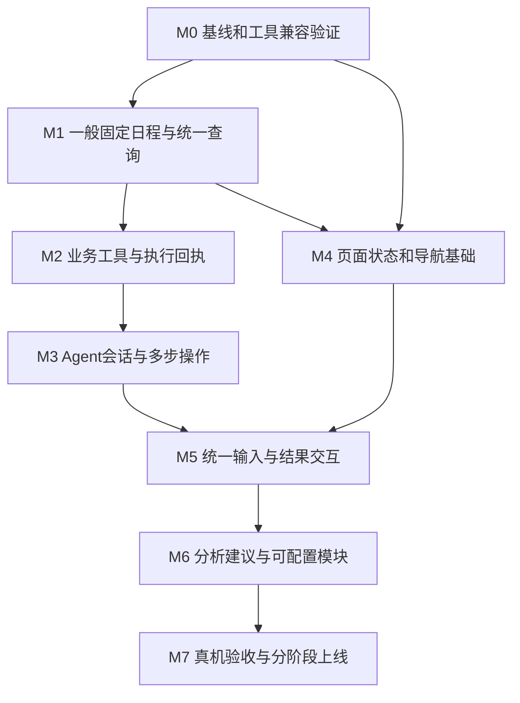

# V2 改造清单与验收顺序

状态：工程改造蓝图，已按用户要求进入开发。固定日程实施见22，会话助手实施见23；下文保留设计时的完整范围，不表示各阶段已全部验收。配套17产品交互方案、18技术选型与可点击原型。按能力依赖推进，不排日期。

## 1 交付边界

设计时的授权为整体设计、原型、技术调研与改造清单。2026-09-26用户要求正式开发，2026-09-27要求继续；当前继续本地实现与验证，不自行定版、打发布包或更新云端。已部署状态不自动回滚。设计完成和工程测试通过均不代表整个产品完成。

现有01／02／03文档保留为V1历史设计。17／18／19是V2提案，涉及不同决定时以V2已确认部分为后续实施依据；用户尚未审阅的选择仍明确属于提案。

## 2 阶段与依赖

图中表示能力依赖，不要求多人并行，也不自动启动子Agent。每阶段结束有可测试的软件结果，后续详细编码计划按阶段拆分。

## 3 各阶段的修改范围

以下路径均相对于仓库`D:/study/Contest/AIC/SemesterOS`。新增路径是建议职责边界，不声称已经存在。

### M0 基线与隔离选型验证

**修改范围**：只在`output/v2-spikes/`隔离环境和合成数据中试验；生产依赖不变。

- 记录当前手机和模拟器包的构建模式、设备、屏幕刷新率；真机profile测量首次进入、Tab往返、切周、输入面板与滚动，区分UI和光栅耗时。
- 用匿名组会原文复现解析失败，记录模型返回类型、校验类别和请求标识；不在日志保留真实学生通知、令牌或密钥。
- LangGraph与当前模型完成18文档第9节验证矩阵，锁定能通过的确切版本；若不通过，按同一数据与指标比较PydanticAI。
- calendar_view与现有TimetableGrid使用同一组长标题、重叠、周日和跨日数据做视觉与性能对照；达标才替换，不能只看官方demo。
- 输出实际命令、版本锁文件、通过／失败场景和耗时，记录淘汰依据。没有证据不称为“更快”或“更稳定”。

**阶段结果**：有真实基线和可复现的工具选择，不涉及用户数据迁移。

### M1 一般固定日程与统一查询

**新增**：`services/api/app/calendar_events/{schemas,service,api,projection}.py`、迁移`0010_calendar_events.py`及`services/api/tests/test_calendar_events.py`。实施前核对当前Alembic head，若已变化则用下一个迁移号，不能覆盖他人迁移。

**修改**：`models.py`、`main.py`、`capacity.py`、`plan_rules.py`、`reminder_rules.py`、`centers.py`与对应测试。

具体要求：

- 新增ScheduleEvent，使用明确区间、暂定与待补信息状态；增加按时间范围读取的CalendarEntry投影。
- 原有课程、考试、个人计划、任务截止映射为不同类型；截止不变成占用区间。
- 固定活动进入所有排程及冲突入口，提醒的更新／取消与事件版本关联。
- 保存组会不自动应用重排；取消组会不自动把个人计划搬回去。
- 所有查询与写入进行账号、学期归属核查；保留原文来源。

**必验**：17:00—18:00组会占用、相邻不重叠、跨日活动、未知结束时间、暂定日期、账号隔离、取消更新提醒、V1任务和考试规则不回退。

**阶段结果**：手工添加组会后可以在日程查询中看到；排程避开它，即使Agent尚未接入也成立。

### M2 业务工具与执行回执

**新增**：`services/api/app/agent/{context,tool_registry,tool_schemas,policy,receipts}.py`、`services/api/tests/test_agent_tools.py`。

**修改**：`operations.py`、`items.py`、`schedule_api.py`、`changes.py`，按需要提取可复用业务函数，避免让工具在服务内部绕一圈HTTP再调用自身。

- 将查询、准备候选、应用和撤销分别定义，工具参数和结果用Pydantic约束。
- 身份只能来自服务端上下文；候选确认绑定对象、版本和参数摘要。
- 数据写入与回执同事务完成，以工具调用ID和参数摘要防止重放。
- 明确提醒修改可直接执行，取消事项／修改现实安排／多段重排走确认策略。
- 执行超时或Agent重复请求时先读回执；后续修改存在时撤销不能覆盖。

**必验**：同一工具重复执行只写一次；伪造ID无权限；过期候选409；提交成功但回答失败仍能读取回执；撤销保留后续用户修改。

**阶段结果**：无需真实模型，用确定性工具输入就能完成和核查端到端业务动作。

### M3 Agent会话与多步操作

**新增**：`services/api/app/agent/{graph,provider,api,worker,events,repository}.py`、Agent线程／run／receipt数据库迁移、`services/api/tests/test_agent_runs.py`、合成场景评估脚本。

**修改**：`main.py`、`runtime_paths.py`、后续审核后的`requirements.lock`和`deploy/compose.cloud.yaml`。

- graph采用18文档的状态与工具边界，真实模型选择工具，业务策略决定可执行范围。
- provider读取当前环境中的模型配置，完成工具结果消息映射，不将品牌名称暴露给App文案。
- run持久化与LangGraph检查点可恢复，worker进程重启不丢失已保存候选。
- 同一会话保存对象引用；跨账号切换清除上下文。对话历史不是业务授权来源。
- 事件流只显示实际阶段与结果；不向用户展示内部思维过程，不伪造执行百分比。
- 执行限额、取消、超时、断网重连和参数修复都有明确终止结果。

**必验**：一句话组会＋调整、跟进“周四不行”、查询本周安排、修改一条提醒、两个同名组会消歧、图片含伪指令、确认时会话过期、worker重启、模型失败但写入成功。

**阶段结果**：后台API能真实完成一条多步日程请求，并提供前端可消费的过程和回执。

### M4 页面状态与导航基础

**新增**：`apps/mobile/lib/features/calendar/{calendar_entry,calendar_repository,calendar_state,calendar_page}.dart`、`features/import/school_picker.dart`与学校注册表。

**修改**：`app/controller.dart`、`features/items/items_controller.dart`、`core/cache.dart`、`features/timetable/shell_page.dart`、`features/centers/hub_data.dart`、`ui/campus_theme.dart`、`ui/campus_widgets.dart`。

- 数据查询按用户／学期／日期范围缓存，Tab页面状态与请求状态分离；保留浏览位置。
- 事实记录可带更新时间展示，分析结果按revision和valid_until决定是否可用。
- 自动刷新使用单一协调入口，相关变更只失效必要范围；错误不清空已有事实内容。
- 按17文档建立字体、间距、按钮组、提示类型与动效规范；先覆盖共享组件。
- 日程组件采用M0验证结果，用统一读模型接入；固定事件禁止自动拖动写入。
- 学校选择先于导入，已适配与未适配状态明确；不改坏现有教务登录链路。

**必验**：连续Tab切换、两个账号与两个学期切换、已缓存与无缓存、分析过期、周日课程、长名称、大字号、周切换与网格手势不冲突。

**阶段结果**：四个目的地的浏览和数据恢复稳定，学校选择可用。

### M5 统一输入与结果交互

**新增**：`apps/mobile/lib/features/assistant/{assistant_sheet,assistant_controller,assistant_state,result_cards,run_client}.dart`和对应widget测试。

**修改**：`features/items/capture_page.dart`、`features/operations/operation_page.dart`、`features/media/media_capture_page.dart`、`features/planning/proposal_page.dart`。旧页面在能力切换稳定后再收回入口，不同时提供两套重复主入口。

- 文字、语音转写和图片识别进入同一线程；保留原文、来源时间和草稿。
- 结果卡展示查询、候选、差异、确认和回执，不让普通请求跳进庞大完整表单。
- 待确认状态支持关掉面板再回来；模型处理中可以取消，已完成写入不因取消对话而消失。
- 保存后局部更新日程、计划与提醒；跨页查看结果后可以返回原会话。
- 手工录入持续可用；AI不可用不阻断普通课表浏览。

**必验**：键盘遮挡、图片上传失败、录音权限拒绝、关闭面板后恢复、确认重复点击、应用结果可见、撤销范围准确、固定安排与个人重排分开确认。

**阶段结果**：用户从统一入口完成原型展示的组会流程，所有结果是真实持久化数据。

### M6 分类标签 统计分析与首页模块

**新增**：`services/api/app/insights/{schemas,service}.py`、Flutter`features/insights`、首页模块配置与账号隔离存储。

用户补充后，还需新增分类与标签服务、统计指标聚合，以及Flutter独立统计页面。建议拆为M6a分类基础、M6b统计页面及联动、M6c建议与模块，依次验收；目前原型中的分析说明卡不能算作统计页已完成。

- M6a：稳定主分类、少量可扩展标签、别名归并、手工修正优先和账号隔离；分类不改变事项时间语义或紧急程度。用同义词、无合适标签、多标签和合并后的历史记录验证。
- M6b：先给统计页面出可交互设计，再实现日期范围、分类筛选、图表与事项列表联动、变化前后对照。验收分类汇总可对账、多标签去重、跨日切分、重叠时长、未知值及计划／实际分离；快速切换时无旧请求覆盖，图表支持减少动画和文字访问。图表库以真实Flutter验证结果选定，尚不指定。
- M6c：在明确指标基础上提供AI解释、下一步操作和首页摘要，建议携带当前时间与分类范围，不为缺数据生成分数或趋势。

- 首批只实现冲突影响、截止余量、可用空档与具体下一步建议。
- 指标由业务计算，AI解释引用指标及对象；不存在数据时返回缺资料，不生成效率评价。
- 用户可以拒绝建议、编辑偏好与关闭普通建议；紧急错误仍清晰展示。
- 模块配置可排序、隐藏和恢复默认，核心课程与紧急事项保持稳定。

**必验**：零任务、耗时未知、暂定考试、计划满但实际未完成、不同用户配置不串、没有进度记录时不虚构复盘。

**阶段结果**：分析帮助完成动作，而不是只增加图表和通知。

### M7 真机验收与分阶段上线

- 对照下表逐项检查24条反馈，使用真实Android设备和profile包验证，记录设备与构建模式。
- 运行已有后端、教务JS和Flutter相关回归；针对新能力增加有区分力的测试，不用快照数量代替行为正确性。
- 新数据库迁移先在云端备份副本验证，所有排程读入口支持event后才开启event写入。
- 通过能力版本或功能开关阻止旧客户端在不完整日程上生成计划；APK本地交付，不上传主站下载。
- 先小范围测试，保留旧接口只读／兼容期和明确回退记录；不能用删除云端数据的方法回退。
- 图形和文字都通过后再定品牌名与Logo、补插画；不将品牌设计阻塞核心流程验收。

**阶段结果**：用户可安装并使用新版，数据保留，关键流程与性能有实测证据。

## 4 反馈覆盖映射

| 反馈 | 方案位置 | 原型可检查内容 | 后续工程验收 |
| --- | --- | --- | --- |
| F01 重复刷新 | 17页面状态；M4 | 顶栏无重复刷新 | 自动刷新、就地重试、下拉范围一致 |
| F02 名称Logo | 17视觉；M7 | 明确占位 | 品牌定稿，不将占位图当完成 |
| F03 首页课程靠后 | 17今日；M4 | 390宽首屏容纳3次课程 | 真机小屏和大字号 |
| F04 全局视觉动效 | 17视觉；M4/M5 | 层次、面板与页面过渡 | 原生实现帧耗时 |
| F05 自定义模块 | 17今日；M6 | 隐藏、上移、恢复默认 | 账号隔离与持久化 |
| F06 底部导航 | 17导航；M4 | 四入口与独立输入条 | 手势、安全区域、遮挡 |
| F07 课表设计感 | 17日程；M4 | 简化头部、不同事件类型 | 高密度数据可读性 |
| F08 视图切换 | 17日程；M4 | 周视图／按天共享日期 | 位置保留与过渡 |
| F09 周切换 | 17日程；M4 | 选周、前后周、回本周 | 手势冲突与请求去重 |
| F10 有用分析 | 17分析；M6 | 固定样例的解释与跳转 | 真实依据与可执行动作 |
| F11 重复教学楼 | 17视觉；M4 | 页面构图不同，没有大插图套版 | 全页面一致性核查 |
| F12 学校选择 | 17学校；M4 | 搜索、已适配／未适配 | 真实教务链路回归 |
| F13 重新计算 | 17计划；M4/M6 | 不常驻维护按钮 | 数据变化触发与版本有效性 |
| F14 学习时间重复 | 17计划；M4 | 单一设置入口 | 路由入口审查 |
| F15 按钮贴合 | 17视觉；M5 | 主次操作间距 | 多字号与翻译长度 |
| F16 规划入口繁杂 | 17智能面板；M3/M5 | 一个入口→预览→结果 | 真实意图与工具调用 |
| F17 分类选择过多 | 17智能面板；M3/M5 | 文本、图像、语音同处 | 识别后无需重新选操作 |
| F18 学期刷新重复 | 17学期；M4 | 没有重复刷新 | 统一数据更新行为 |
| F19 时间轴堆按钮 | 17学期；M4 | 周带＋重要节点 | 当前周定位、大量节点 |
| F20 反复加载 | 17状态；M4 | 页面切换不清空原型状态 | 原生缓存与后台更新 |
| F21 同步提示突兀 | 17状态；M4 | 普通说明与离线状态分开 | 实际失败原因与恢复入口 |
| F22 组会识别失败 | 17场景；M0/M1/M3 | 正确表达固定时间区间 | 原失败复现、模型及校验修复 |
| F23 掉帧 | 17性能；M0/M4/M7 | 仅检查HTML动画可关闭 | 真机profile对比，不据原型声称修复 |
| F24 全局问题 | 全文与M7 | 共享交互规范 | 全页面、全状态走查 |

用户补充的Agent目标落在M2/M3/M5；成熟工具优先落在M0与18文档；全面日程分析落在M1/M6。算法方向只是待验证假设，未声明原创算法已完成。

## 5 审阅原型的方法

直接打开`docs/prototypes/v2/index.html`，保留同目录CSS和JS即可；不需要开发服务器或安装依赖。也可以打开`output/v2-prototype/V2-interactive-preview.html`单文件导出。

建议按“今日 → 智能输入 → 组会示例 → 核对提醒 → 加入日程 → 调整建议 → 应用 → 日程查看 → 计划撤销”浏览，再看学校选择和学期周带。原型没有真实账户、模型请求、语音采集或图片上传。任意文本不在示例范围内会如实说明，而不是假装识别。

后续需要用户审阅的是布局和操作方式。框架内部实现方式、服务端流程节点等技术细节由工程验证决定，不要求用户逐项审批工具调用。
